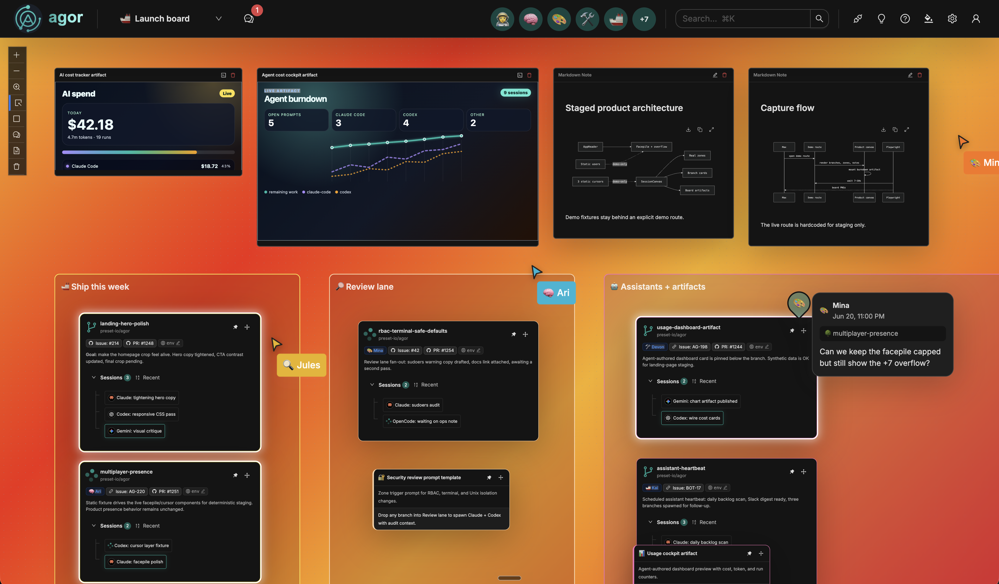
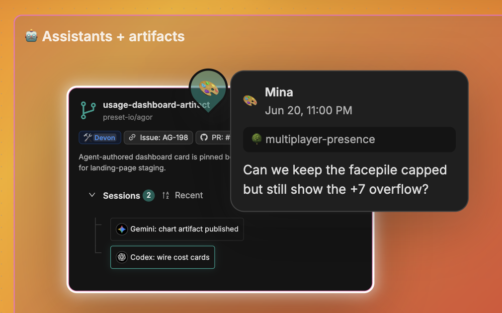
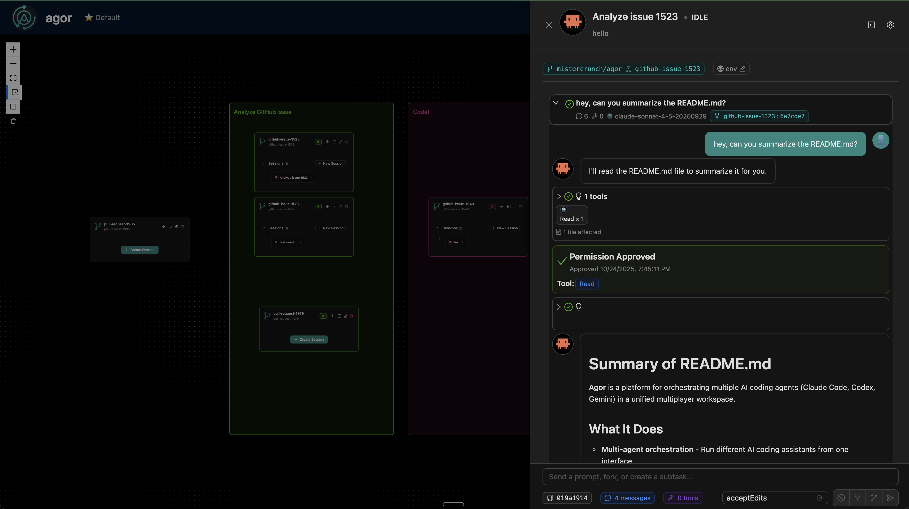
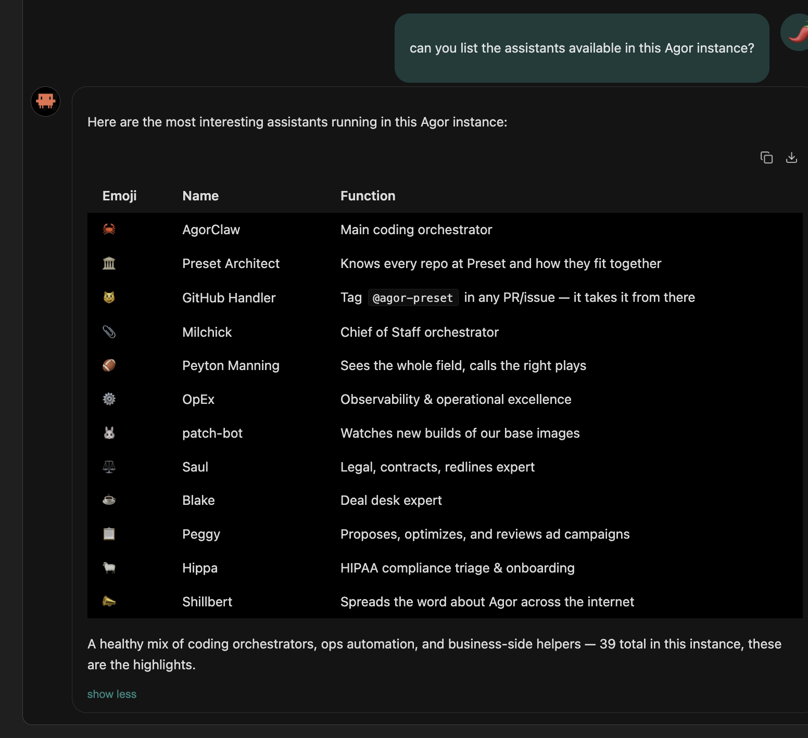
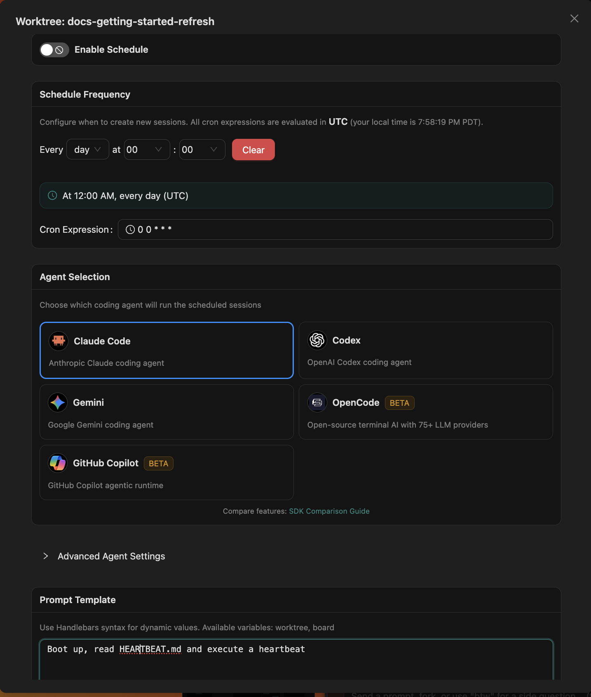
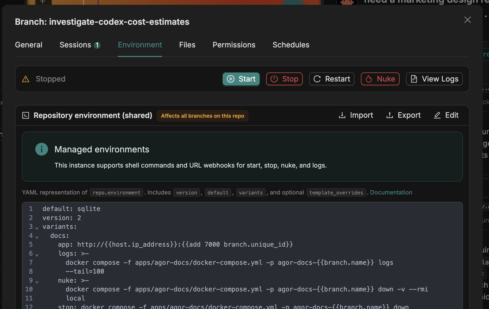
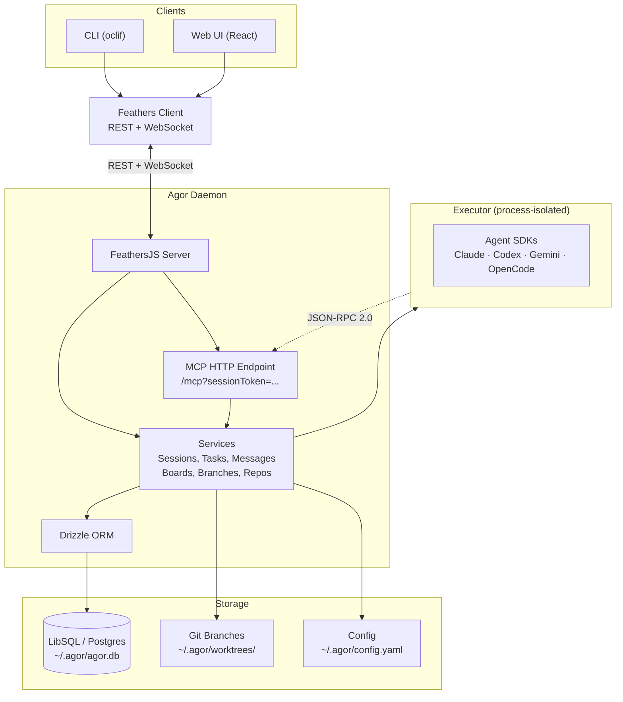

# Agor

### Meet your team of AI assistants.

**Team command center for all things agentic.**

Everyone's cranking with AI, but it's chaos: scattered sessions, ephemeral context, nothing that
compounds. Agor is where your team raises real assistants — not throwaway agents. You decide what
each one is for, wire it into the systems you already use (MCP and skills), and let it act on a
schedule instead of waiting to be asked. It all happens in one shared, self-hosted place, so what
works for one person finally reaches everyone.

[](LICENSE)
[](https://agor.live/guide/getting-started)
[](https://discord.gg/Qh4TrFQZpd)

**[Documentation](https://agor.live/) · [Quick Start](#quick-start) · [Architecture](#architecture) · [Contributing](#development)**

<!--
  HERO VIDEO PLACEHOLDER
  A ~1-minute product tour is in production. When the asset lands, embed/link it here, e.g.:
  [](https://www.youtube.com/watch?v=VIDEO_ID)
  Until then, the unscripted demo below stands in.
-->



_The board: branches as cards, zones as regions, teammates and their agents present live._

**▶ [Watch the unscripted demo on YouTube](https://www.youtube.com/watch?v=3in0qh7ZH0g)** (13 min)

---

## Why Agor

Agor gives your team's AI work a place to live — shared, observable, and self-hosted:

- **Team workspace for AI agents** — multiplayer is the core differentiator. Live cursors,
  facepile, scoped comments, shared sessions, and shared dev environments.
- **Real assistants, not throwaway agents** — long-lived helpers with identity, file-based
  memory, and skills. Taught conversationally, then given a real job on a schedule.
- **Branches as the anchor** — one entity per piece of work, where conversations, dev
  environment, prompts, issues, and the PR all converge.
- **Multi-agent, multi-runtime** — Claude Code, Codex, Gemini, OpenCode, Copilot, and Cursor
  (beta) are interchangeable per session. Bring your own provider; no frontier lock-in.
- **MCP-native** — anything a user can do in Agor, an agent can do too. Sessions are
  auto-issued an MCP token, so agents fork, spawn, schedule, and report on their own work.
- **Self-hosted** — your repos, your DB (LibSQL or Postgres), your isolation posture. BSL 1.1.

---

## Quick Start

Requires **Node.js ≥ 22.12** ([install](https://nodejs.org)).

```bash
npm install -g agor-live

agor init           # creates ~/.agor/ and the database
agor daemon start   # runs the daemon in the background
agor open           # opens the web UI
```

That's it — add a repo and create your first session from the onboarding wizard.

Prefer Homebrew? See the [Getting Started guide](https://agor.live/guide/getting-started) for the
brew path. For Docker, source builds, Postgres, and team setups, see
[Extended Installation](https://agor.live/guide/extended-install).

---

## Core Concepts

Agor is built on three foundational entities — everything else builds on these:

- **[Branches](https://agor.live/guide/branches)** — the unit of work. A first-class git working
  directory on its own branch, with an isolated dev environment and its own conversations.
  Conventionally 1 branch = 1 feature/PR.
- **[Sessions & Trees](https://agor.live/guide/sessions)** — agent conversations with genealogy.
  **Fork** to explore alternatives (copies context), **spawn** subsessions for focused subtasks
  (fresh context window).
- **[Boards & Zones](https://agor.live/guide/boards)** — a Figma-like 2D canvas of branches. Drop
  a branch into a zone to fire a templated prompt.

**[Read the Features Overview →](https://agor.live/guide/features-overview)**

---

## Key Capabilities

|                                                                        |                                                                                                                                                            |
| ---------------------------------------------------------------------- | ---------------------------------------------------------------------------------------------------------------------------------------------------------- |
| **[Assistants](https://agor.live/guide/assistants)**                   | Long-lived AI coworkers with identity, file-based memory, and a skill system — taught conversationally, then equipped with tools, channels, and schedules. |
| **[Agor MCP Server](https://agor.live/guide/internal-mcp)**            | Agor exposes itself over MCP. Agents introspect sessions, branches, and boards, and drive the system themselves.                                           |
| **[Multiplayer & Social](https://agor.live/guide/multiplayer-social)** | Live cursors, facepiles, spatial comments, and a shared multiplayer terminal.                                                                              |
| **[Rich Chat UX](https://agor.live/guide/rich-chat-ux)**               | Per-prompt token + dollar accounting, model/effort selectors, structured tool blocks, completion chimes.                                                   |
| **[Environments](https://agor.live/guide/environment-configuration)**  | One-click dev servers per branch with auto-managed unique ports — no more port fights.                                                                     |
| **[Knowledge](https://agor.live/guide/knowledge)**                     | A shared, searchable markdown knowledge base — one place for decisions, runbooks, prompts, and agent memory.                                               |
| **[Scheduler](https://agor.live/guide/scheduler)**                     | Cron-style triggers for templated prompts. Powers assistant heartbeats, standups, and automated audits.                                                    |
| **[Message Gateway](https://agor.live/guide/message-gateway)**         | Slack and GitHub as portals into Agor sessions.                                                                                                            |
| **[Artifacts](https://agor.live/guide/artifacts)**                     | Live, interactive apps (dashboards, mockups, tools) rendered directly on the board.                                                                        |
| **[Cards](https://agor.live/guide/cards)** (Beta)                      | Generic workflow entities for non-code workflows.                                                                                                          |

---

## Screenshots

<div align="center">
  <table>
    <tr>
      <td width="50%">
        
        <p align="center"><em>Real-time multiplayer — cursors, facepile, scoped comments</em></p>
      </td>
      <td width="50%">
        
        <p align="center"><em>Rich agent sessions with structured tool blocks</em></p>
      </td>
    </tr>
    <tr>
      <td width="50%">
        
        <p align="center"><em>Persistent assistants with memory and skills</em></p>
      </td>
      <td width="50%">
        
        <p align="center"><em>MCP-native — agents drive Agor themselves</em></p>
      </td>
    </tr>
    <tr>
      <td width="50%">
        
        <p align="center"><em>Scheduler — cron-style triggers for templated prompts</em></p>
      </td>
      <td width="50%">
        
        <p align="center"><em>One-click dev environments per branch</em></p>
      </td>
    </tr>
  </table>
</div>

---

## Architecture



The **daemon** (`apps/agor-daemon`, FeathersJS) owns the database, services, WebSocket events, and
the MCP HTTP endpoint. The **executor** (`packages/executor`) is a process-isolated runtime that
spawns agents via their SDKs and can run as a separate Unix user. Shared types, the Drizzle schema,
and git utilities live in `@agor/core` (`packages/core`).

**[Full Architecture Guide →](https://agor.live/guide/architecture)**

### Repository layout

```
agor/
├── apps/
│   ├── agor-daemon/   # FeathersJS backend (REST + WebSocket + MCP)
│   ├── agor-ui/       # React UI (Ant Design + React Flow)
│   ├── agor-cli/      # oclif CLI
│   └── agor-docs/     # Docs site (Nextra) — canonical reference, published at agor.live
├── packages/
│   ├── core/          # @agor/core — types, db (Drizzle), git, api
│   └── executor/      # Process-isolated agent runtime
└── context/           # Agent-oriented cheat sheets and design docs
```

---

## Development

The fastest path to a running dev instance from source:

```bash
git clone https://github.com/preset-io/agor
cd agor
docker compose up
# Visit http://localhost:5173 → login: admin@agor.live / admin
```

Prefer running locally without Docker? The two-process workflow (daemon in watch mode + UI dev
server) and the `.agor.yml` variants (sqlite / postgres / full / docs) are documented in the
[Development Guide](https://agor.live/guide/development). It also covers running Agor _inside_ Agor
for dogfooding.

See **[CONTRIBUTING.md](CONTRIBUTING.md)** for the contribution workflow, and **[CLAUDE.md](CLAUDE.md)**
for the agent-oriented map of the codebase.

---

## Roadmap

**[View the roadmap on GitHub →](https://github.com/preset-io/agor/issues?q=is%3Aissue+state%3Aopen+label%3Aroadmap)**

Highlights:

- **Match CLI-native features** — push integrations deeper as the agent SDKs expose more.
- **Bring your own IDE** — attach VS Code, Cursor, or any IDE to Agor-managed branches over SSH/Remote.
- **Unix user integration** — true multi-tenancy with per-user OS isolation. [Read the guide →](https://agor.live/guide/multiplayer-unix-isolation)
- **Agor Cloud** — managed hosting for teams who'd rather not self-host. [Learn more →](https://agor.live/blog/agor-cloud)

---

<div align="center">

### ✨ Pledge ✨

**⭐️ I pledge to fix a GitHub issue for every star Agor gets :)**

</div>

---

## Community

- **[Discord](https://discord.gg/Qh4TrFQZpd)** — support and discussion
- **[GitHub Discussions](https://github.com/preset-io/agor/discussions)** — questions and ideas
- **[GitHub Issues](https://github.com/preset-io/agor/issues)** — bugs and feature requests

## License

[Business Source License 1.1](LICENSE).

## About

**Heavily prompted by [@mistercrunch](https://github.com/mistercrunch)** ([Preset](https://preset.io),
[Apache Superset](https://github.com/apache/superset), [Apache Airflow](https://github.com/apache/airflow)),
built by an army of Claudes.

Read the story: [Making of Agor →](https://agor.live/blog/making-of-agor)
</content>
</invoke>
