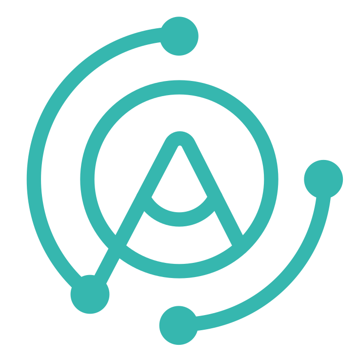

# Agor

**Multiplayer AI. Work together again.**

Agor brings your team and agents together on live spatial boards where you can see the work,
collaborate, and learn from each other. Raise AI teammates with memory, shared knowledge, skills,
and connections to your tools, then bring them where your team works. What works for one person
becomes something the whole team can build on.

Under the hood, Agor is a web workspace for running coding agents (Claude Code, Codex, Gemini, and
others) on isolated git branches, each with its own dev environment and conversation history.
Install it with npm and start on your own in a few minutes, then bring your team in.

[](https://www.npmjs.com/package/agor-live)
[](LICENSE)
[](https://agor.live/guide/getting-started)
[](https://discord.gg/Qh4TrFQZpd)

**[Documentation](https://agor.live/) · [Quick Start](#quick-start) · [Agor Cloud Open Beta](https://agor.live/cloud) · [Architecture](#architecture) · [Contributing](#development)**

---

## Built on the agent CLIs & SDKs you already use

Agor ships no model of its own. It drives the coding-agent CLIs and SDKs you already run,
interchangeable per session. Bring your own provider and subscription, with no vendor lock-in.
[Compare the harnesses →](https://agor.live/guide/sdk-comparison)

<p align="center">
  <a href="https://github.com/anthropics/claude-code">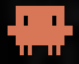</a>
  &nbsp;&nbsp;
  <a href="https://github.com/openai/codex">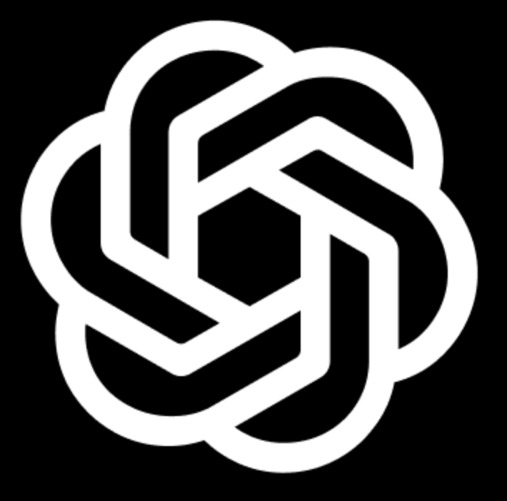</a>
  &nbsp;&nbsp;
  <a href="https://github.com/google-gemini/gemini-cli">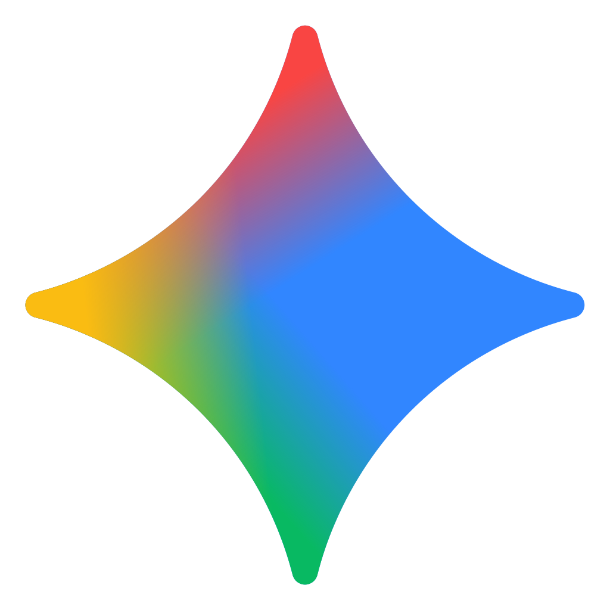</a>
  &nbsp;&nbsp;
  <a href="https://github.com/features/copilot">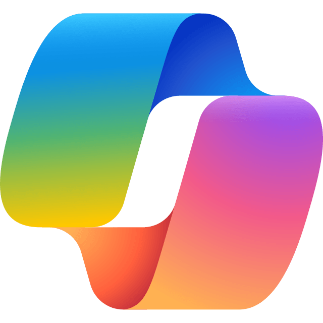</a>
  &nbsp;&nbsp;
  <a href="https://github.com/sst/opencode"></a>
  &nbsp;&nbsp;
  <a href="https://cursor.com"></a>
</p>

<!--
  HERO VIDEO PLACEHOLDER
  A ~1-minute product tour is in production. When the asset lands, embed/link it here, e.g.:
  [](https://www.youtube.com/watch?v=VIDEO_ID)
  Until then, the unscripted demo below stands in.
-->

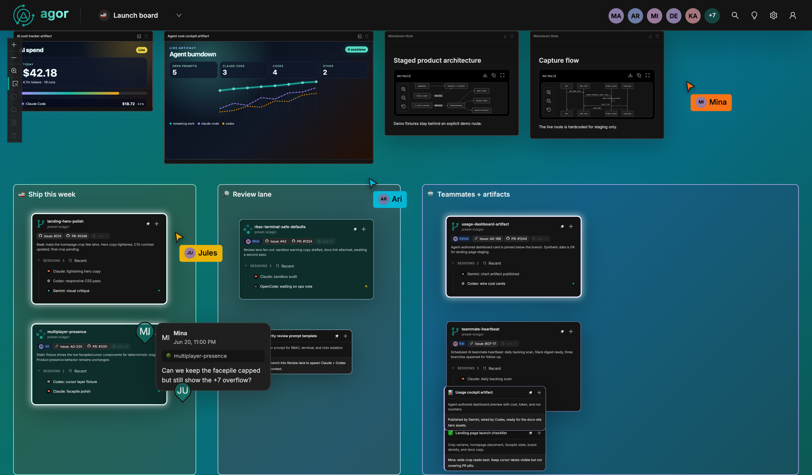

_The board: your team and agents in one place, with branches as cards, zones as regions, and sessions you can follow live._

**▶ [Watch the unscripted demo on YouTube](https://www.youtube.com/watch?v=3in0qh7ZH0g)** (13 min)

---

## Why Agor

Most teams are getting better at AI one person at a time. Good prompts sit in private chats, useful
workflows live in one person's setup, and running more agents means more to keep track of. Agor
makes AI work a team activity.

### Bring your team and agents together

- **See and join each other's work.** Live cursors, comments, and shared sessions let colleagues
  follow an agent's progress and step in, instead of reconstructing it from screenshots and status
  messages.
- **Learn from each other.** See how colleagues prompt, share context, and turn the practices that
  work into prompts and workflows the whole team can reuse.
- **Start solo, expand when ready.** One person can install Agor and get value on day one, then
  bring colleagues in.

### See the work and shape it together

- **A live spatial board.** Organize branches and agent sessions on a 2D canvas. Zones give the
  work structure, show its stage, and can fire a templated prompt when a branch is dropped in.
- **Branches as the anchor.** Every piece of work is a git branch with its own working directory,
  dev environment, conversation history, and PR.
- **Shared dev environments.** A one-click dev server per branch, with ports assigned
  automatically so parallel branches never collide and anyone can inspect the result.
- **Rich sessions and session trees.** Structured tool output, model and effort selectors, and
  fork/spawn genealogy for exploring alternatives or coordinating specialist agents.
- **Multi-runtime.** Claude Code, Codex, Gemini, OpenCode, Copilot, and Cursor (beta) are
  interchangeable per session.

### Raise AI teammates

- **Memory and shared knowledge.** Each teammate gets a Knowledge-base namespace for durable,
  searchable context that the team and other teammates can build on.
- **Skills and MCP.** Capture repeatable ways of working as skills, and connect teammates to the
  tools your team uses. Agor also exposes itself over MCP, so agents can fork, spawn, schedule, and
  report on their own work.
- **Where your team works.** Reach teammates through gateway channels such as Slack and GitHub.
  Nobody has to live on the board to benefit.
- **Schedules.** Run standups, audits, digests, and other recurring work without a fresh prompt
  each time.

### Know what's running, what it costs, and who can do what

- **Governance and observability.** Branch-scoped RBAC, per-user credentials and env vars, and
  per-prompt token and dollar accounting with durable history across sessions.
- **Self-hosted or managed.** Run Agor on your own infrastructure with your repos and database
  (LibSQL or Postgres) and explicit execution modes (trusted local, fail-closed sandbox, or
  delegated external execution). Prefer not to run it yourself? See
  [Agor Cloud Open Beta](https://agor.live/cloud).

---

## Quick Start

Requires **Node.js ≥ 22.12** ([install](https://nodejs.org)) and **Git** on `PATH`. HTTPS remotes also require a working system CA trust store; SSH remotes require an SSH client and configured keys or agent access.

```bash
npm install -g agor-live

agor init           # creates config/database and installs the tools you select
agor daemon start   # runs the daemon in the background
agor open           # opens the web UI
```

Use `agor install` later to change or repair the selected agentic tools; it does not initialize or recreate Agor.

That's it. The onboarding wizard creates your first board and helps you
[raise your first AI teammate](https://agor.live/guide/first-teammate), which takes it from there.

The [Getting Started guide](https://agor.live/guide/getting-started) walks through the wizard and
includes a Docker Compose path if you would rather not install Node. For source builds, Postgres,
and team setups, see [Extended Installation](https://agor.live/guide/extended-install). For
managed hosting, see [Agor Cloud Open Beta](https://agor.live/cloud).

---

## Core Concepts

Agor is built on three foundational entities. Everything else builds on these:

- **[Branches](https://agor.live/guide/branches)**: the unit of work. A first-class git working
  directory on its own branch, with an isolated dev environment and its own conversations.
  Conventionally 1 branch = 1 feature/PR.
- **[Sessions & Trees](https://agor.live/guide/sessions)**: agent conversations with genealogy.
  **Fork** to explore alternatives (copies context), **spawn** subsessions for focused subtasks
  (fresh context window).
- **[Boards & Zones](https://agor.live/guide/boards)**: a live 2D canvas of branches and sessions. Drop
  a branch into a zone to fire a templated prompt.

**[Read the Features Overview →](https://agor.live/guide/features-overview)**

---

## Key Capabilities

|                                                                           |                                                                                                                                                                                                     |
| ------------------------------------------------------------------------- | --------------------------------------------------------------------------------------------------------------------------------------------------------------------------------------------------- |
| **[Multiplayer & Social](https://agor.live/guide/multiplayer-social)**    | Live cursors, facepiles, spatial comments, and a shared multiplayer terminal, so the team can follow and join agent work.                                                                           |
| **[Boards & Zones](https://agor.live/guide/boards)**                      | A live spatial board for organizing branches and sessions. Zones show the stage of the work and trigger reusable prompts.                                                                           |
| **[Teammates](https://agor.live/guide/teammates)**                        | Persistent AI teammates, each with its own Knowledge-base namespace for durable, searchable memory. Taught conversationally, then equipped with skills, MCP tools, gateway channels, and schedules. |
| **[Knowledge](https://agor.live/guide/knowledge)**                        | A shared, searchable markdown knowledge base. One place for decisions, runbooks, prompts, and agent memory.                                                                                         |
| **[Message Gateway](https://agor.live/guide/message-gateway)**            | Work with teammates from Slack and GitHub, without opening the board.                                                                                                                               |
| **[Scheduler](https://agor.live/guide/scheduler)**                        | Cron-style triggers for templated prompts. Powers teammate heartbeats, standups, and automated audits.                                                                                              |
| **[Agor MCP Server](https://agor.live/guide/internal-mcp)**               | Agor exposes itself over MCP. Agents introspect sessions, branches, and boards, and drive the system themselves.                                                                                    |
| **[Rich Chat UX](https://agor.live/guide/rich-chat-ux)**                  | Per-prompt token and dollar accounting, model/effort selectors, structured tool blocks, completion chimes.                                                                                          |
| **[Environments](https://agor.live/guide/environment-configuration)**     | One-click dev servers per branch with automatically managed unique ports, so the team can inspect the same running build.                                                                           |
| **[Artifacts](https://agor.live/guide/artifacts)**                        | Live, interactive apps (dashboards, mockups, tools) rendered directly on the board.                                                                                                                 |
| **[Security & RBAC](https://agor.live/guide/multiplayer-unix-isolation)** | Branch-scoped permission tiers, per-user credentials and env vars, and explicit execution modes (`simple` / `sandbox` / `delegated`).                                                               |
| **[Cards](https://agor.live/guide/cards)** (Beta)                         | Generic workflow entities for non-code workflows.                                                                                                                                                   |

---

## Screenshots

<div align="center">
  <table>
    <tr>
      <td width="50%">
        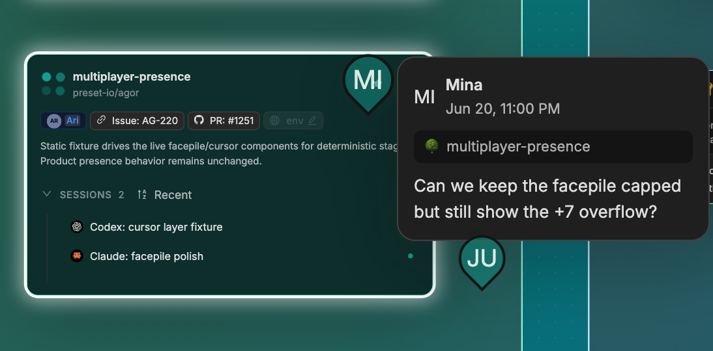
        <p align="center"><em>Work together in real time: cursors, facepile, scoped comments</em></p>
      </td>
      <td width="50%">
        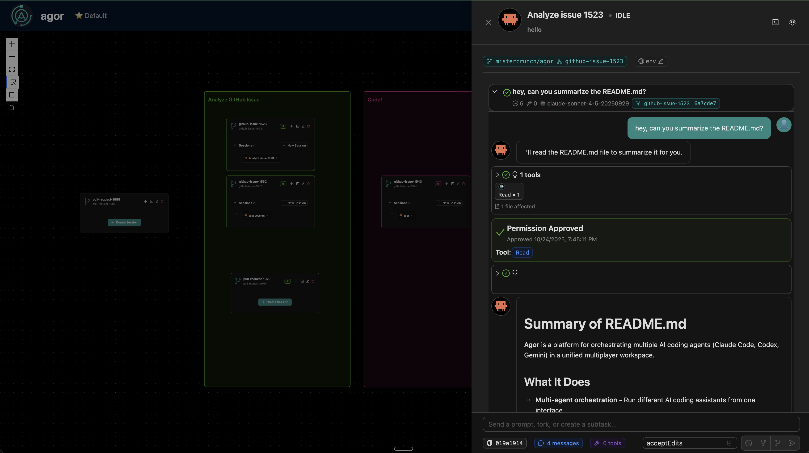
        <p align="center"><em>Rich agent sessions with structured tool blocks</em></p>
      </td>
    </tr>
    <tr>
      <td width="50%">
        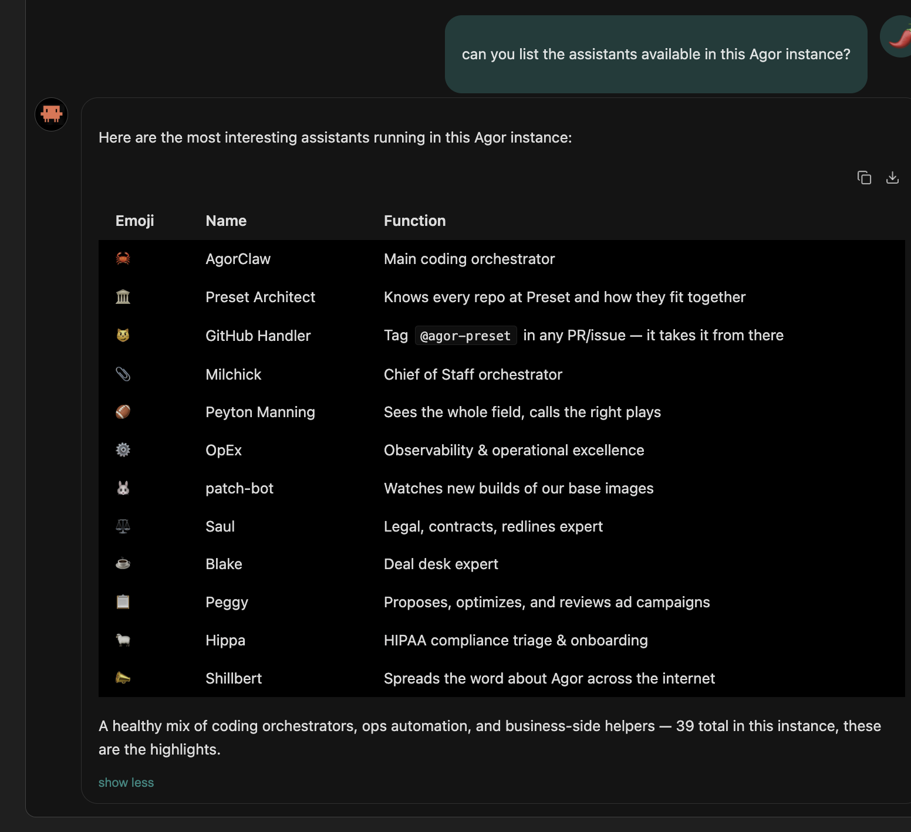
        <p align="center"><em>Persistent AI teammates with memory and skills</em></p>
      </td>
      <td width="50%">
        
        <p align="center"><em>MCP-native: agents drive Agor themselves</em></p>
      </td>
    </tr>
    <tr>
      <td width="50%">
        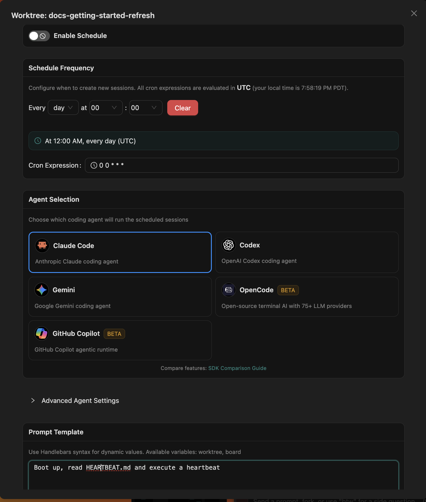
        <p align="center"><em>Scheduler: cron-style triggers for recurring work</em></p>
      </td>
      <td width="50%">
        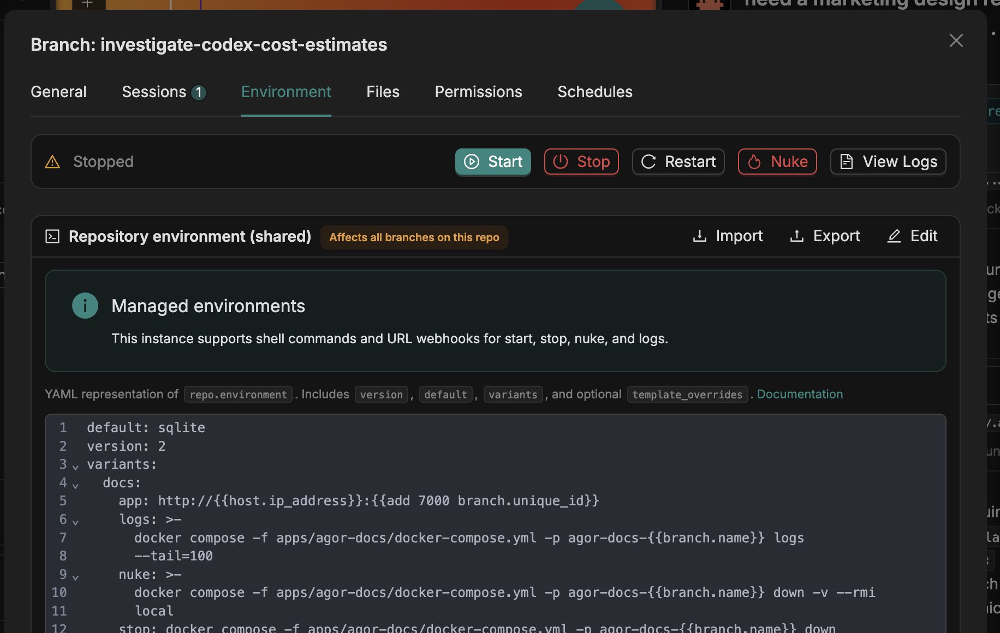
        <p align="center"><em>One-click dev environments per branch</em></p>
      </td>
    </tr>
  </table>
</div>

---

## Architecture

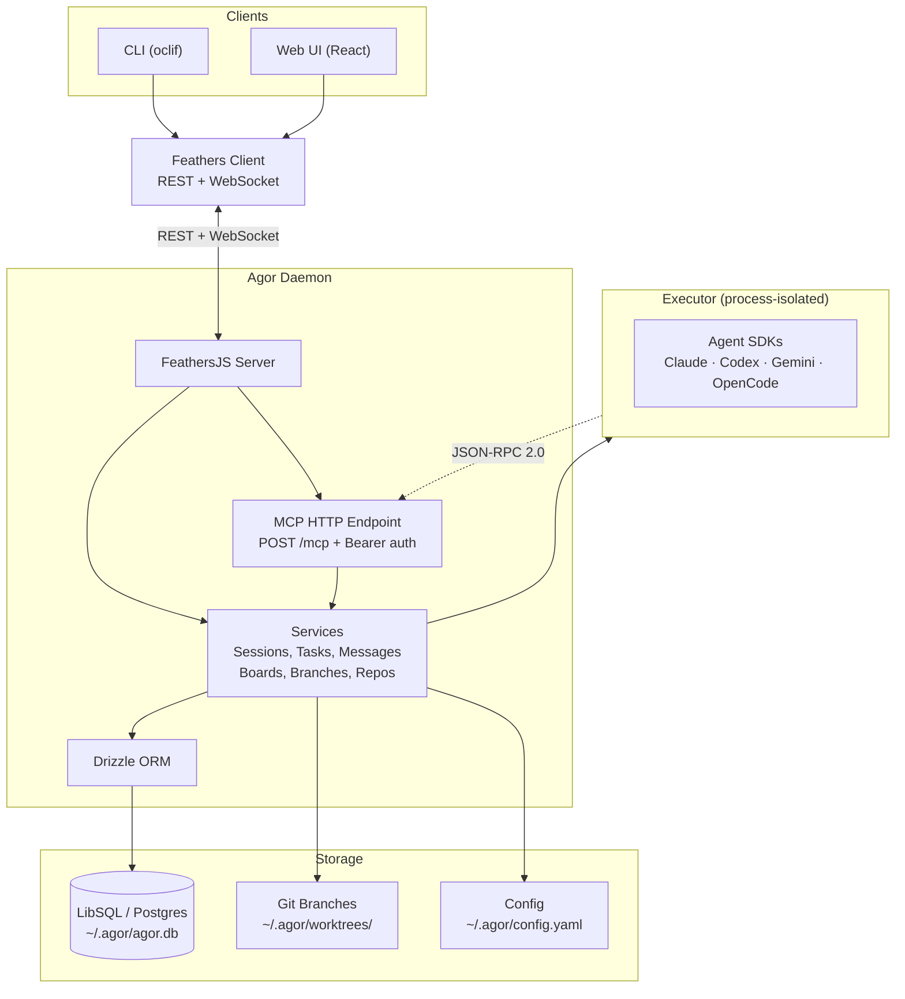
```mermaid
graph TB
    subgraph Clients
        CLI["CLI (oclif)"]
        UI["Web UI (React)"]
    end

    Client["Feathers Client<br/>REST + WebSocket"]

    subgraph "Agor Daemon"
        Feathers["FeathersJS Server"]
        MCP["MCP HTTP Endpoint<br/>POST /mcp + Bearer auth"]
        Services["Services<br/>Sessions, Tasks, Messages<br/>Boards, Branches, Repos"]
        ORM["Drizzle ORM"]
    end

    subgraph Executor["Executor (process-isolated)"]
        AgentSDKs["Agent SDKs<br/>Claude · Codex · Gemini · OpenCode"]
    end

    subgraph Storage
        DB[("LibSQL / Postgres<br/>~/.agor/agor.db")]
        Git["Git Branches<br/>~/.agor/worktrees/"]
        Config["Config<br/>~/.agor/config.yaml"]
    end

    CLI --> Client
    UI --> Client
    Client <-->|REST + WebSocket| Feathers

    Feathers --> Services
    Feathers --> MCP
    MCP --> Services
    Services --> ORM
    Services --> Executor
    Executor -.->|JSON-RPC 2.0| MCP

    ORM --> DB
    Services --> Git
    Services --> Config
```

The **daemon** (`apps/agor-daemon`, FeathersJS) owns the database, services, WebSocket events, and
the MCP HTTP endpoint. The **executor** (`packages/executor`) is a process-isolated runtime that
spawns agents via their SDKs locally, inside the filesystem sandbox, or through a delegated external substrate. Shared types, the Drizzle schema,
and git utilities live in `@agor/core` (`packages/core`).

**[Full Architecture Guide →](https://agor.live/guide/architecture)**

### Repository layout

```
agor/
├── apps/
│   ├── agor-daemon/   # FeathersJS backend (REST + WebSocket + MCP)
│   ├── agor-ui/       # React UI (Ant Design + React Flow)
│   ├── agor-cli/      # oclif CLI
│   └── agor-docs/     # Docs site (Nextra), the canonical reference, published at agor.live
├── packages/
│   ├── core/          # @agor/core: types, db (Drizzle), git, api
│   └── executor/      # Process-isolated agent runtime
└── context/           # Agent-oriented cheat sheets and design docs
```

---

## Development

The fastest path to a running dev instance from source:

```bash
git clone https://github.com/preset-io/agor
cd agor
docker compose up
# Visit http://localhost:5173 → login: admin@agor.live / admin
```

Prefer running locally without Docker? The two-process workflow (daemon in watch mode + UI dev
server) and the `.agor.yml` variants (sqlite / postgres / rich / HA / docs) are documented in the
[Development Guide](https://agor.live/guide/development). It also covers running Agor _inside_ Agor
for dogfooding.

See **[CONTRIBUTING.md](CONTRIBUTING.md)** for the contribution workflow, and **[CLAUDE.md](CLAUDE.md)**
for the agent-oriented map of the codebase.

---

<div align="center">

### ✨ Pledge ✨

**⭐️ I pledge to fix a GitHub issue for every star Agor gets :)**

</div>

---

## Community

- **[Discord](https://discord.gg/Qh4TrFQZpd)**: support and discussion
- **[GitHub Discussions](https://github.com/preset-io/agor/discussions)**: questions and ideas
- **[GitHub Issues](https://github.com/preset-io/agor/issues)**: bugs and feature requests

## License

[Business Source License 1.1](LICENSE) (`BUSL-1.1`). Agor is source-available,
not open source, before the Change Date.

The Additional Use Grant permits production use, including internal and
self-hosted commercial use. It does not permit commercializing Agor itself by
offering its agent-orchestration functionality to third parties as a product or
service, whether hosted, managed, or bundled for customers to operate.
Consulting, support, integration, modification, use within a broader product or
service, and single-customer internal deployments remain permitted subject to
the license terms. Contact Preset, Inc. about alternative commercial licensing.

On **January 15, 2029**, or the fourth anniversary of the first public BSL
distribution of a particular version (whichever comes first), that version
converts to the **Apache License 2.0**. The [license text](LICENSE) controls if
this summary differs from it.

## About

**Heavily prompted by [@mistercrunch](https://github.com/mistercrunch)** ([Preset](https://preset.io?utm_source=agor&utm_medium=referral&utm_campaign=agor-readme),
[Apache Superset](https://github.com/apache/superset), [Apache Airflow](https://github.com/apache/airflow)),
built by an army of Claudes and Codexes.

**Read more:** [Announcing Agor Cloud Open Beta](https://agor.live/blog/agor-cloud-open-beta) ·
[Agent Modeling 101](https://agor.live/blog/agent-modeling-101) ·
[Raise a team helper agent in an afternoon](https://agor.live/blog/raise-team-helper-agent) ·
[all posts →](https://agor.live/blog)
