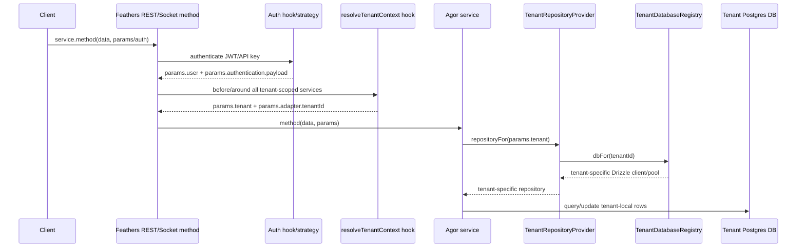
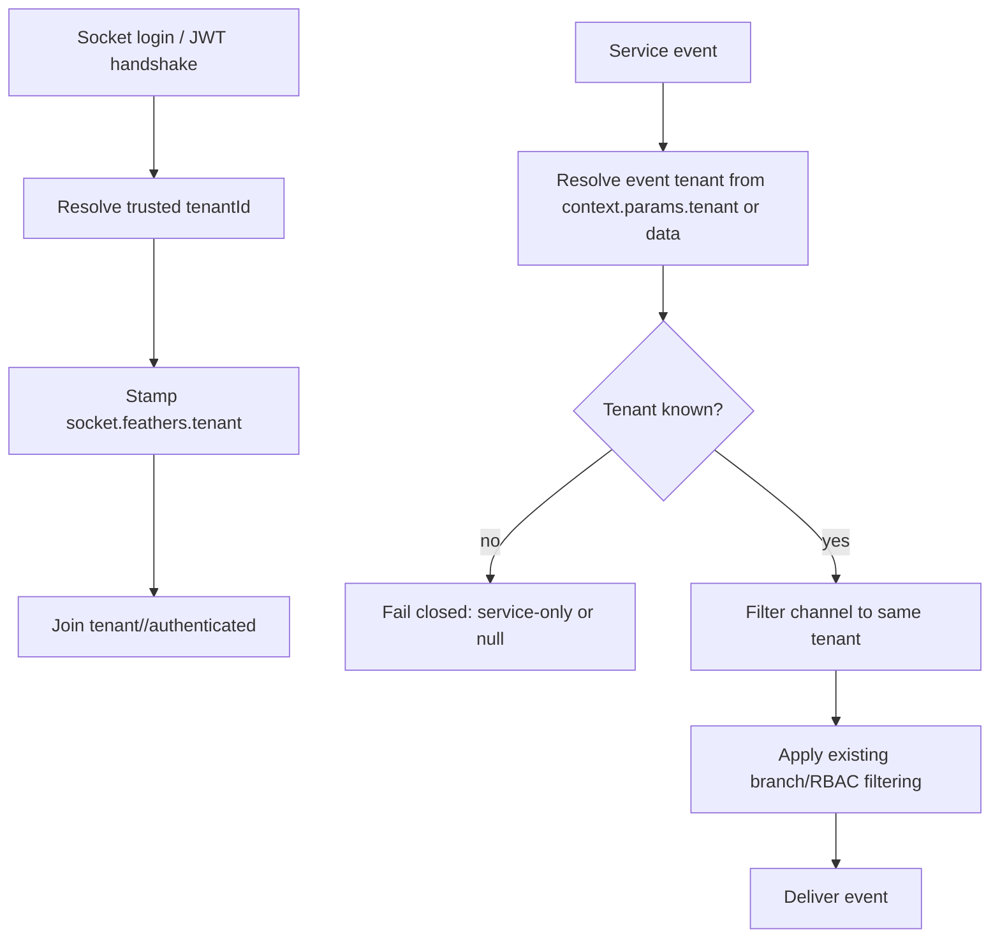
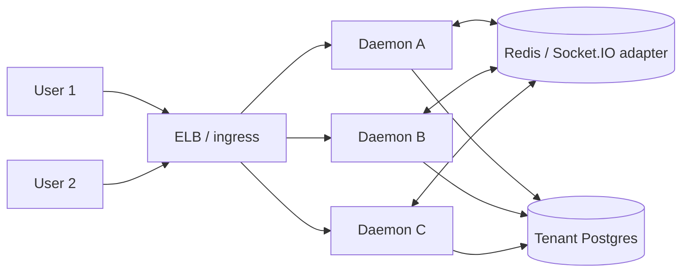
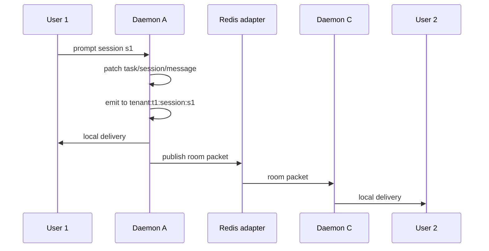

# Multi-tenant daemon POC (exploratory)

This folder is intentionally a **presentation/PR scaffold**, not a production
feature flag. It shows where the tenant boundary should live if one daemon serves
multiple Agor tenants backed by separate Postgres databases.

## Request path



## Realtime path



## Files

- `tenant-context.ts`: hook-level mechanics for trusted tenant resolution.
- `tenant-db-registry.ts`: lazy DB/pool registry and repository provider.
- `tenant-channel-scope.ts`: fail-closed websocket tenant filter.
- `tenant-routed-adapter-poc.ts`: small standalone adapter sketch.
- `tenant-routing-poc.test.ts`: tests demonstrating same IDs in two tenants do
  not cross and missing tenant events fail closed.

## Production integration points

1. **Auth/JWT resolution**: `apps/agor-daemon/src/auth/service-jwt-strategy.ts`
   should validate or surface a trusted tenant claim. Socket handshake logic in
   `apps/agor-daemon/src/setup/socketio.ts` needs the same tenant resolution.
2. **App/service hook**: register `resolveTenantContext()` after auth and before
   tenant-scoped service hooks.
3. **Database seam**: `apps/agor-daemon/src/adapters/drizzle.ts` now accepts a
   `RepositoryResolver`, so a service can resolve repositories from `params`
   without mutating a global DB.
4. **Direct DB users**: services/hooks/routes that keep `this.db`, `branchRepo`,
   or `app.get('database')` need to move to providers or be explicitly marked as
   landlord/global-only.
5. **Realtime**: tenant filtering must be unconditional and happen before the
   current branch/RBAC filtering in `utils/realtime-publish.ts`.
6. **Background jobs/executors/MCP**: every non-HTTP path must carry tenant id;
   otherwise tenant-scoped DB access should throw.

## HA / autoscaled sockets mental model

Rooms are not assigned to daemon pods. A room is a logical label that exists on
whatever pods currently have local sockets joined to that room. The load
balancer does not need a room map, and we should not shard tenants/sessions to
specific daemons for the initial architecture.



If User 1 and User 2 both view `tenant:t1:session:s1` but connect to different
pods, both sockets join the same deterministic room name on their respective
pods. An emit to that room from any pod is fanned out through the Socket.IO
adapter; each receiving pod delivers only to its local sockets in that room.



### Scaling notes

- Redis here is pub/sub fanout, not the durable message queue/source of truth.
- Socket events are live hints; tenant Postgres remains durable truth.
- On disconnect/reconnect, clients should resubscribe rooms and refetch current
  page/session state over REST to recover missed events.
- Room-targeted emits avoid scanning every connected socket. Cost is closer to
  `O(pods) + O(room recipients)`, not `O(total users)` per event.
- A broad `authenticated` channel scan is the path to avoid at GA scale.
- For thousands of tenants, DB pool lifecycle is a separate bottleneck: lazy
  pools, small max size, idle eviction, and likely PgBouncer/managed pooling.
- Background jobs still need distributed locks/queues; Socket.IO Redis adapter
  only solves realtime fanout.

## Tenant placement / pooling note

For thousands of GA/self-serve tenants, schema-per-tenant inside a shared/cell
Postgres database may be a better default than database-per-tenant. It preserves
normal app pool behavior:

```text
10 pods × small number of cell DB pools × pool max N
```

instead of:

```text
10 pods × active tenants × pool max N
```

The likely placement model is hybrid:

```ts
type TenantPlacement =
  | { kind: 'cell-schema'; cellId: string; schema: string; role: string }
  | { kind: 'dedicated-database'; databaseUrl: string; databaseUser: string };
```

Caveat for review: shared-login `SET LOCAL ROLE` is not automatically a full
SQL-injection containment boundary. If the shared app pool user can assume every
tenant role, arbitrary injected SQL might be able to `RESET ROLE` / `SET ROLE`
unless permissions are designed and tested carefully. The app pool user should
not have direct cross-tenant table access; tenant roles should be `NOLOGIN`,
minimal, and preferably non-inherited. Dedicated tenant DB users remain the
stronger isolation tier.
