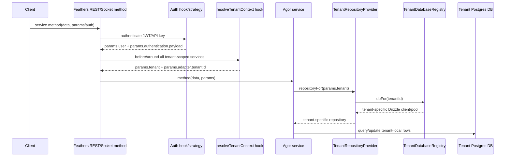
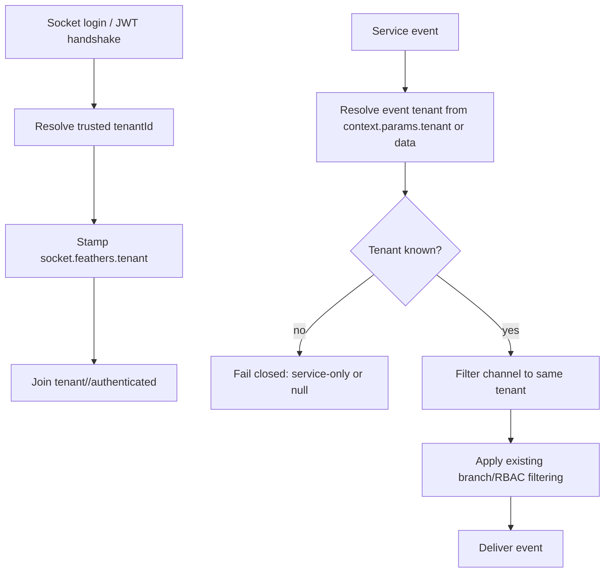

# Multi-tenant daemon POC (exploratory)

This folder is intentionally a **presentation/PR scaffold**, not a production
feature flag. It shows where the tenant boundary should live if one daemon serves
multiple Agor tenants backed by separate Postgres databases.

## Request path

## Realtime path

## Files

- `tenant-context.ts`: hook-level mechanics for trusted tenant resolution.
- `tenant-db-registry.ts`: lazy DB/pool registry and repository provider.
- `tenant-channel-scope.ts`: fail-closed websocket tenant filter.
- `tenant-routed-adapter-poc.ts`: small standalone adapter sketch.
- `tenant-routing-poc.test.ts`: tests demonstrating same IDs in two tenants do
  not cross and missing tenant events fail closed.

## Production integration points

1. **Auth/JWT resolution**: `apps/agor-daemon/src/auth/service-jwt-strategy.ts`
   should validate or surface a trusted tenant claim. Socket handshake logic in
   `apps/agor-daemon/src/setup/socketio.ts` needs the same tenant resolution.
2. **App/service hook**: register `resolveTenantContext()` after auth and before
   tenant-scoped service hooks.
3. **Database seam**: `apps/agor-daemon/src/adapters/drizzle.ts` now accepts a
   `RepositoryResolver`, so a service can resolve repositories from `params`
   without mutating a global DB.
4. **Direct DB users**: services/hooks/routes that keep `this.db`, `branchRepo`,
   or `app.get('database')` need to move to providers or be explicitly marked as
   landlord/global-only.
5. **Realtime**: tenant filtering must be unconditional and happen before the
   current branch/RBAC filtering in `utils/realtime-publish.ts`.
6. **Background jobs/executors/MCP**: every non-HTTP path must carry tenant id;
   otherwise tenant-scoped DB access should throw.
