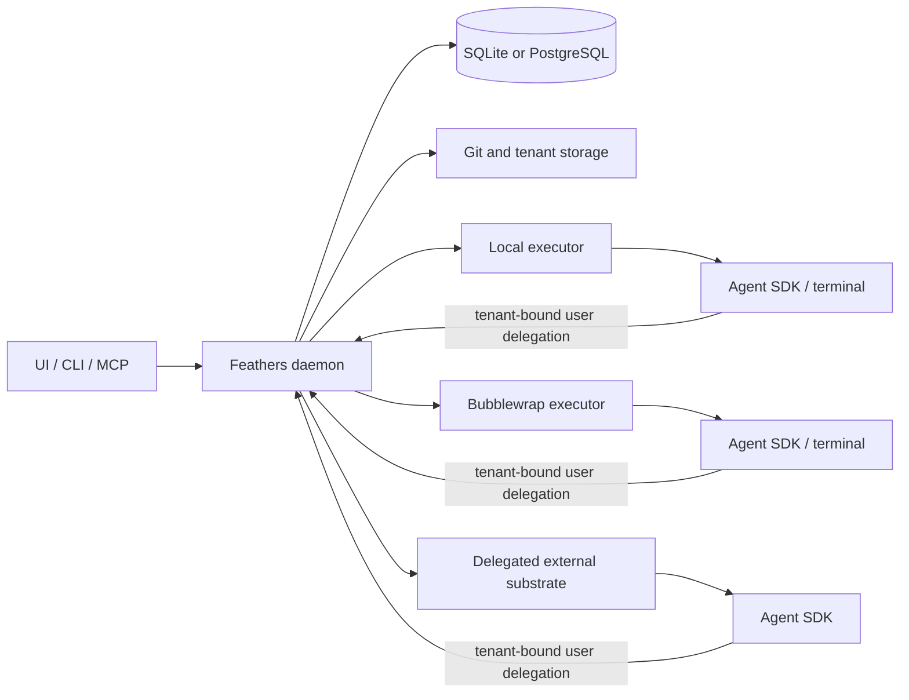
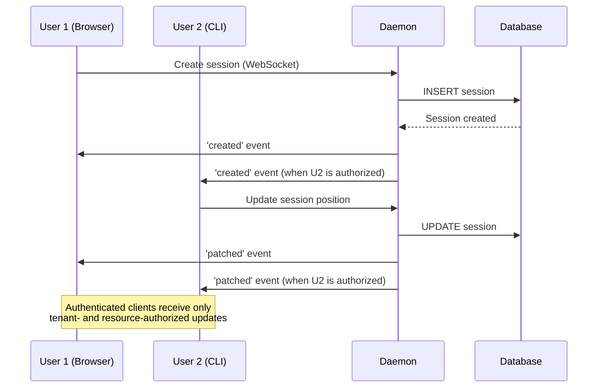

# Architecture Overview

Agor is a **multi-client agent orchestration platform** with real-time collaboration, built on a local-first daemon architecture.

## System Architecture

<a id="current-architecture-executor-isolation" />

### Current architecture (execution substrates)

The daemon owns trusted state and authorization. Executors contain agent SDKs
and terminal work and have no direct database connection. A task executor
authenticates as the user who initiated it, with tenant and task context signed
by the daemon. Ordinary Feathers calls then use the same role and resource
authorization as that user's UI, CLI, or client calls. Exact task context is
checked again only for executor-only operations such as lifecycle reporting,
streaming publication, and plaintext runtime credential resolution. Launch
policy is explicit: trusted local execution (`simple`), fail-closed Linux
bubblewrap filesystem isolation (`sandbox`), or a configured external launcher
(`delegated`).



Key properties:

- Application RBAC and trusted tenant context are enforced at daemon boundaries.
- Executors do not receive database credentials or direct database access.
- Task executors are not service accounts and do not bypass normal user RBAC.
- Sandbox mode derives read/write/hidden mounts from RBAC and never falls back
  to simple mode when bubblewrap is unavailable.
- Delegated launchers receive stable tenant/user identifiers and own runtime,
  home, credential, storage, cancellation, and containment enforcement.
- Agor does not create host accounts, POSIX branch groups, or sudo-impersonate
  executor processes.

## Technology Stack

### Backend

- **[FeathersJS](https://feathersjs.com/)** - Unified REST + WebSocket API framework
- **[Drizzle ORM](https://orm.drizzle.team/)** - Type-safe database layer with LibSQL support
- **[LibSQL](https://github.com/tursodatabase/libsql)** - Local SQLite-compatible database
- **[simple-git](https://github.com/steveukx/simple-git)** - Git operations for branch management

### Frontend

- **[React 18](https://react.dev/)** + **[Vite](https://vitejs.dev/)** - Fast development with HMR
- **[Ant Design](https://ant.design/)** - Enterprise UI component library
- **[React Flow](https://reactflow.dev/)** - Interactive session canvas with drag-and-drop
- **[Socket.IO Client](https://socket.io/)** - Real-time WebSocket connection

### Typed TypeScript Client (`@agor-live/client`)

The UI and CLI both consume the daemon through a published, fully-typed client package. It's the same shape of API your own scripts and integrations use. There is no second-class "internal API."

```typescript
import { createClient, createRestClient } from '@agor-live/client';

const url = 'http://localhost:3030';
const loginClient = await createRestClient(url);
const { accessToken } = await loginClient.authenticate({ strategy: 'local', email, password });
const agor = createClient(url, true, {
  socketAuthentication: { accessToken },
});

// Strongly-typed CRUD across every service
const { data: branches } = await agor.service('branches').find({
  query: { board_id: boardId },
});

const session = await agor.service('sessions').create({
  branch_id: branches[0].id,
  agentic_tool: 'claude-code',
  initial_prompt: 'Add OAuth login',
});

// Real-time WebSocket events with typed payloads
agor.service('messages').on('created', msg => {
  console.log(`${msg.role}: ${msg.content}`);
});
```

**What you get:**

- **Branded ID types**: `BranchId`, `SessionId`, `BoardId` aren't interchangeable; the compiler catches mix-ups.
- **Service hooks across REST + WebSocket**: One subscription, one event API; the same `created`/`patched`/`removed` pattern for every entity.
- **Schema-driven types**: Generated from Drizzle ORM models so DB schema changes propagate to clients at compile time.
- **Authentication strategies built in**: `local`, `jwt`, and `api-key` share one client surface; delegated executor JWTs carry daemon-signed tenant/user identity, while exact task or bounded command claims protect only executor-specific capabilities.
- **Same client the UI uses**: Whatever pattern works for an Agor screen works for your script.

> If you're integrating Agor into your own tooling, prefer `@agor-live/client` over raw HTTP. You'll inherit every type and event the product evolves.

### CLI

- **[oclif](https://oclif.io/)** - Enterprise-grade CLI framework

### Agent Integration

- **[@anthropic-ai/claude-agent-sdk](https://github.com/anthropics/claude-agent-sdk)** - Claude Code capabilities with CLAUDE.md auto-loading
- **[OpenAI SDK](https://github.com/openai/openai-node)** - Codex integration with custom permission system
- **[Google Generative AI SDK](https://ai.google.dev/)** - Gemini integration (beta)

## Real-Time Multiplayer

Agor achieves multiplayer collaboration through **FeathersJS real-time events**:

### WebSocket Event Flow



**Key Features:**

- **Authorized publication** - FeathersJS emits only to authenticated
  connections in the event's tenant, further filtered by board/branch/resource
  access where applicable
- **Service-level events** - `created`, `patched`, `removed`, `updated`
- **Custom events** - Board-authorized cursor positions (100ms throttle),
  tenant-scoped online presence without resource identity, and a separate
  low-frequency board-association stream authorized for both publisher and
  subscriber
- **Fail-closed routing** - Missing/conflicting tenant context has no global
  broadcast fallback; clients cannot select tenant rooms
- **Optimistic UI** - React hooks listen to events and update state immediately

## Core Services

The daemon exposes 12 FeathersJS services via REST and WebSocket:

| Service                 | Purpose                       | Key Operations                      |
| ----------------------- | ----------------------------- | ----------------------------------- |
| **sessions**            | Agent sessions with genealogy | CRUD, fork, spawn, prompt execution |
| **tasks**               | Work units within sessions    | CRUD, completion tracking           |
| **messages**            | Conversation history          | CRUD, pagination, streaming         |
| **boards**              | Spatial session organization  | CRUD, session positioning           |
| **branches**            | Git branch isolation          | Create, list, delete branches       |
| **repos**               | Git repository management     | Clone, list, branch operations      |
| **users**               | User accounts & auth          | CRUD, JWT authentication            |
| **mcp-servers**         | MCP server configs            | CRUD, capability queries            |
| **session-mcp-servers** | Session MCP links             | Associate MCP servers with sessions |
| **context**             | Context file browser          | Read-only access to context/ files  |
| **terminals**           | WebSocket terminal proxy      | PTY sessions for live terminals     |
| **health-monitor**      | Real-time diagnostics         | System health, connection status    |

## Agor as an MCP Server

Agor exposes itself as a **Model Context Protocol (MCP) server** through the same daemon instance that serves the REST and WebSocket APIs. This enables both **internal agents** (running within Agor sessions) and **external tools** to interact with Agor programmatically.

Looking for a deeper dive into what agents can do with those tools? See the [Agor MCP Server](./internal-mcp) guide.

### Automatic Session Integration

Agor configures its MCP server automatically for agents running in sessions, using
short-lived credentials scoped to the authenticated caller. Normal tenant and
resource permissions still apply. Tokens must use the `Authorization: Bearer`
header; query-string tokens are rejected to keep them out of access logs.

### Self-Aware Agent Capabilities

Agents running in Agor sessions can **introspect their own execution context**:

**Understand Their Identity:**

```typescript
→ agor_sessions_get_current()
← {
    session_id: "019a1...",
    agentic_tool: "claude-code",
    branch_id: "019a2...",
    board_id: "019a3...",
    status: "running"
  }
```

**Query Sibling Sessions:**

```typescript
→ agor_sessions_list({ boardId: "019a3...", status: "running" })
← { total: 3, data: [...other sessions on same board...] }
```

**Spawn Child Sessions (Multi-Agent Delegation):**

```typescript
→ agor_sessions_spawn({
    prompt: "Write integration tests for the auth module",
    title: "Auth Tests"
  })
← { session_id: "019a4...", status: "running", ... }
```

**Manage User Profile:**

```typescript
→ agor_users_update_current({ name: "Agent Helper", emoji: "🤖" })
← { user_id: "019a5...", name: "Agent Helper", emoji: "🤖" }
```

This enables **autonomous multi-agent workflows** where a parent agent can delegate subtasks to specialized child agents, monitor their progress, and coordinate work across multiple sessions.

### Usage Modes

- **Internal agents:** Agor supplies session credentials automatically.
- **External clients:** Configure authentication and the `/mcp` endpoint using the
  [MCP connection guide](/guide/internal-mcp). Access remains subject to the
  authenticated user’s tenant and resource permissions.

### Architecture: Same Daemon Instance

The MCP server runs on the **same FeathersJS HTTP server** as the REST and WebSocket APIs:

```
https://localhost:3030/
├── /sessions (REST)
├── /tasks (REST)
├── /mcp (MCP JSON-RPC 2.0)
└── wss:// (WebSocket Secure)
```

**Why this design?**

- ✅ Single process to manage (no separate MCP server)
- ✅ MCP tools call FeathersJS services directly (no HTTP overhead)
- ✅ Proper WebSocket event broadcasting when MCP tools create/update resources
- ✅ Shared database connection and service layer

## MCP Tools Reference

The MCP server provides a growing toolkit across sessions, branches, boards, tasks, users, environments, cards, artifacts, and more, enabling structured programmatic access instead of brittle CLI parsing. See the [Agor MCP Server](/guide/internal-mcp) page for the up-to-date capability map.

```typescript
// ❌ Brittle approach
$ agor session list | grep running | wc -l

// ✅ Structured MCP approach
→ agor_sessions_list({ status: 'running' })
← { total: 3, data: [...] }
```

For tool discovery, parameters, and orchestration examples, use the
[Agor MCP Server guide](/guide/internal-mcp). MCP operations use the same service
validation and authorization as other Agor clients.

## Data Architecture

### Hybrid Schema Strategy

Agor uses a **hybrid materialization approach** for cross-database compatibility (LibSQL → PostgreSQL):

**Materialized Columns** (indexed):

- Primary keys, foreign keys, status, timestamps
- Used for filtering, joins, sorting

**JSON Blobs** (flexible):

- Nested objects (genealogy, config)
- Arrays (tasks, contextFiles, children)
- Rarely queried metadata

**Benefits:**

- Migration-free schema evolution
- Fast indexed queries
- Cross-database compatibility (LibSQL ↔ PostgreSQL)

### Branch-Based Isolation

Every session requires a branch (foreign key constraint):

```
~/.agor/
├── agor.db              # Database
├── repos/               # Bare repositories
│   └── myapp/
└── branches/           # Session branches
    └── myapp/
        ├── main/        # Session 1 branch
        └── feat-auth/   # Session 2 branch
```

**Why branches?**

- Parallel development without branch switching
- Session isolation (no shared working directory)
- Natural mapping for fork/spawn operations

## Authentication

Three authentication strategies (all require credentials; there is no anonymous path):

1. **Local** (email/password) - JWT-based authentication for user login
2. **JWT** - Token validation for user, service, terminal, and task-executor credentials
3. **API Key** - Long-lived `agor_sk_…` tokens for scripts and CI

On a fresh install with zero users, the daemon auto-creates an admin user on first start, writing the generated password to `~/.agor/admin-credentials` (mode 0600) and printing it once to the daemon log.

**Executor-session JWT details:**

- Used exclusively by executor processes to authenticate with daemon
- Signed, expiring JWTs are generated by `SessionTokenService` and verified by the shared JWT strategy
- PostgreSQL authority stores only a SHA-256 fingerprint plus tenant, user, session, task, branch, expiry, revocation, and use-policy facts
- Every connection revalidates durable authority; active exact-token revocation retires the matching executor connection across replicas
- The accepted Socket.IO connection owns an immutable tenant/user/session/task/branch projection and may join only its exact task-control room

All strategies use FeathersJS authentication with configurable storage.

## Health & Readiness Probes

The daemon exposes three **unauthenticated** monitoring endpoints:

| Endpoint  | Purpose                    | Touches DB? | Status codes                     |
| --------- | -------------------------- | ----------- | -------------------------------- |
| `/livez`  | Liveness (process alive)   | **No**      | `200` (when responsive)          |
| `/readyz` | Readiness (can serve)      | **Yes**     | `200` healthy · `503` DB down    |
| `/health` | Rich status for UI / admin | **Yes**     | `200` always (`status` reflects) |

`/readyz` runs a time-bounded `SELECT 1` and returns `{ status, db: { ok, latencyMs } }`.
`/health` stays `200` always (pre-login UI fetches must not throw) and carries the
signal on `status` (`ok`/`degraded`); authenticated callers also get the DB error,
masked DB URL, and a non-gating pending-migrations count.

Wire k8s probes liveness→`/livez`, readiness→`/readyz`. **Never** point liveness
at a DB-checking endpoint, or a DB outage restarts every pod (fleet-wide crash
loop) instead of just pulling them from rotation:

```yaml
livenessProbe:
  httpGet: { path: /livez, port: 3030 }
readinessProbe:
  httpGet: { path: /readyz, port: 3030 }
```

## Next Steps

- **[Getting Started](/guide/getting-started)**: Install and run Agor
- **[Agor MCP Server](/guide/internal-mcp)**: The agent-facing automation surface
- **[Security](/security)**: Deployment modes, RBAC, execution isolation, and trust boundaries
- **[SDK Comparison](/guide/sdk-comparison)**: Capability matrix across agent SDKs
- Run `agor --help` for complete CLI documentation
