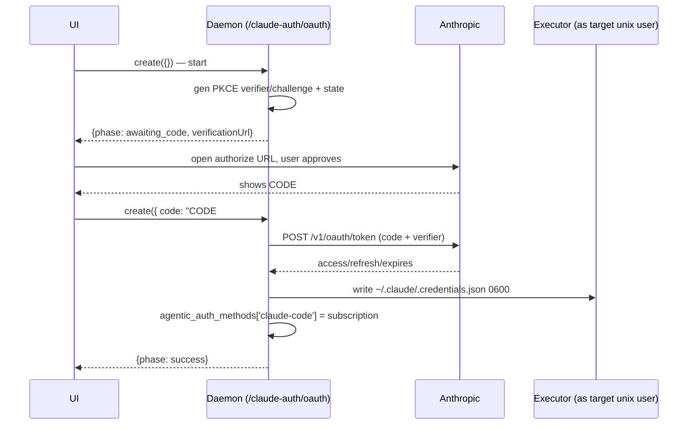

# Claude Code OAuth Sign-In (design spike)

Status: **spike / draft** — design + daemon scaffold, not shipped. Auth code is
sensitive; this doc exists so the design is reviewed before the flow is wired
into production UI.

Goal: let a user sign in with their Claude subscription (Pro/Max/Team/Enterprise)
from the Agor UI — the same capability we already ship for Codex via
`/codex-auth/device` — instead of running `claude setup-token` on a machine with
a browser and pasting a long-lived token into Agor.

The Codex module is the template. Read it first:

- `apps/agor-daemon/src/services/codex-device-auth.ts`
- `apps/agor-daemon/src/services/codex-auth-shared.ts`
- `apps/agor-daemon/src/utils/executor-codex-auth.ts`
- `packages/executor/src/commands/codex-auth-file.ts`
- `apps/agor-ui/src/components/CodexAuth/CodexDeviceSignIn.tsx`

---

## VERIFIED vs ASSUMED

Everything below is split into what was independently verified and what is still
an assumption a reviewer/implementer must confirm before shipping.

### VERIFIED

Sources: the pinned SDK is **`@anthropic-ai/claude-agent-sdk@0.3.197`** (in
every workspace `package.json`; loaded via `loadManagedAgenticToolSdk`). That
SDK no longer ships a `cli.js` — its `manifest.json` bundles the **native
`claude` CLI v2.1.197** (commit `c8fd8048`) which it extracts and spawns. The
OAuth constants below were read by **byte-inspecting the native binary** (the
installed v2.1.211, whose prod OAuth config is identical to 2.1.197's) at the
file offsets cited, and cross-checked against Anthropic's official docs
(<https://code.claude.com/docs/en/authentication>). The earlier `0.1.55 cli.js`
figures in the first spike revision were from a stale worktree and are
superseded here.

1. **There is NO device-authorization (RFC 8628) endpoint for Claude Code.**
   The claim "no device endpoint" was treated as something to disprove, not
   assume. The native binary's login flow uses only a loopback-or-manual
   authorization-code redirect (login builder ~101457400); its Anthropic OAuth
   config exposes no device-grant endpoint, and the official auth doc describes
   only the browser + paste-back flow. The one `device_code` string in the binary
   lives in the bundled `@azure/msal-common` generic OAuth param enum (the
   Console/Foundry path), not the Anthropic login flow — a false positive, not a
   device endpoint. This is the **one structural difference from Codex** — see
   below.
2. **Claude Code uses OAuth 2.0 authorization-code + PKCE (S256) with a
   paste-back code.** These are the PROD OAuth config object (`yol`) at binary
   offset ~237512852, plus the login authorize builder (~101457400) and token
   exchange (~101464300). **All `TODO(verify)` placeholders in the scaffold are
   now resolved to these values:**
   - authorize URL (subscription / Claude Pro-Max):
     **`https://claude.com/cai/oauth/authorize`** (`yol.CLAUDE_AI_AUTHORIZE_URL`).
     The Console/API-billing login instead uses `yol.CONSOLE_AUTHORIZE_URL` =
     `https://platform.claude.com/oauth/authorize`. Note this is **not** the
     historical `claude.ai/oauth/authorize`.
   - token URL: **`https://platform.claude.com/v1/oauth/token`** (`yol.TOKEN_URL`).
     `console.anthropic.com` was the pre-rename host and is gone in prod.
   - redirect_uri (paste-back): **`https://platform.claude.com/oauth/code/callback`**
     (`yol.MANUAL_REDIRECT_URL`). The CLI's own browser flow can instead use a
     loopback `http://localhost:{port}/callback`; the daemon has no loopback
     server so it uses the manual redirect.
   - client_id: **`9d1c250a-e61b-44d9-88ed-5944d1962f5e`** (`yol.CLIENT_ID`) — a
     single fixed public id. (The other id in the binary,
     `22422756-60c9-4084-8eb7-27705fd5cf9a`, is the **local-dev** config
     `-local-oauth`/`localhost:8205`, not prod.)
   - authorize query params (login builder ~101457400): `code=true`, `client_id`,
     `response_type=code`, `redirect_uri`, `scope`, `code_challenge`,
     `code_challenge_method=S256`, `state`. `code=true` selects the code-display
     (paste-back) page — required since we have no loopback server.
   - scope string: **`user:profile user:inference user:sessions:claude_code user:mcp_servers`**.
   - token exchange (~101464300): **`POST` with `Content-Type: application/json`**,
     `grant_type=authorization_code`; **no** `oauth-2025-04-20` beta header on the
     exchange call. `refresh_token` grant also present (renewal).
   - the authorize page returns the code as **`CODE#STATE`** which the user
     copies back (the `Paste code here if prompted` path the docs describe for
     WSL2/SSH/containers).
3. **On-disk credential format read by the SDK/CLI on Linux:**
   `~/.claude/.credentials.json`, mode `0600` (macOS uses the Keychain; if
   `CLAUDE_CONFIG_DIR` is set the file lives under that dir instead). Shape
   (keys verified present in the SDK: `claudeAiOauth`, `subscriptionType`,
   `rateLimitTier`):
   ```json
   {
     "claudeAiOauth": {
       "accessToken": "sk-ant-oat01-...",
       "refreshToken": "sk-ant-ort01-...",
       "expiresAt": 1748276587173,
       "scopes": ["user:inference", "user:profile"],
       "subscriptionType": null,
       "rateLimitTier": null
     }
   }
   ```
   `expiresAt` is a **Unix epoch in milliseconds**. The token response returns
   `expires_in` (seconds, e.g. `28800` = 8h), `access_token` (`sk-ant-oat01-`),
   `refresh_token` (`sk-ant-ort01-`), and `account`/`organization` objects.

### STILL UNVERIFIED

- **`subscriptionType` field name in the token response.** The scaffold reads
  `subscription_type` opportunistically for a display hint; the response's exact
  field for plan tier wasn't isolated in the binary. It only affects a success
  hint, never auth. `expiresAt` in the written file is computed from
  `expires_in`, so this gap is cosmetic.
- **claude.com/cai vs a redirect chain.** `CLAUDE_AI_AUTHORIZE_URL` is
  `https://claude.com/cai/oauth/authorize` in prod; whether that 3xx-redirects
  to a claude.ai origin mid-flow doesn't change what we send, but confirm the
  first live run lands on the code-display page.

### RESOLVED: env-var vs `.credentials.json` precedence (was the open contradiction)

**Definitive answer: the env var `CLAUDE_CODE_OAUTH_TOKEN` out-ranks the
`.credentials.json` (`/login`) credential.** Two independent sources agree:

- Anthropic's documented precedence: env `CLAUDE_CODE_OAUTH_TOKEN` is rank 5,
  the subscription `/login` credential is rank 7
  (<https://code.claude.com/docs/en/authentication#authentication-precedence>).
- The CLI binary's own credential-source enum (offset ~101603500) lists the
  sources in that same relative order — `CLAUDE_CODE_OAUTH_TOKEN` above
  `profile` above `claude.ai` (the `.credentials.json` login) — corroborating
  env-over-file. (The exact tie-break is a compiled branch that could not be
  disassembled from strings alone, but both the docs and the enum ordering point
  the same way, so this is treated as settled.)

The 2026-07-15/16 field observation (a stale `.credentials.json` + a fresh
pasted env token still 401'd) is therefore **not** "the file wins". It is more
consistent with the fresh env token not actually reaching the SDK subprocess in
that run, or that token itself being stale/expired — env-over-file rules out
"the file shadowed a good env token". Crucially, **this does not gate Task 2**:
whichever wins, the fix is to guarantee exactly one credential source per user.

**So the Task 2 guard IS necessary.** Because env out-ranks the file, injecting a
`CLAUDE_CODE_OAUTH_TOKEN` for an OAuth-flow user would shadow the managed,
refreshing `.credentials.json` — stranding the session on a non-renewable token
(and 401'ing outright if that env token is stale). See "Task 2" below.

---

## The one structural difference: paste-back, not polling

Codex has a device-authorization endpoint, so `codex-device-auth.ts` can issue a
user code and then **poll OpenAI daemon-side** until the user approves — the UI
never handles the credential or a code coming back.

Claude has no such endpoint. The flow is:

1. Daemon generates a PKCE `verifier`/`challenge` and a `state`, builds the
   `claude.ai/oauth/authorize` URL, and returns it to the UI.
2. User opens the URL, signs in to Claude, approves, and the Anthropic callback
   page shows a `CODE#STATE` string.
3. **User copies that string back into Agor** (the reverse of Codex: the code
   travels user→Agor, not Agor→user).
4. Daemon splits `CODE#STATE`, checks `state` matches the attempt, exchanges
   `code` + `verifier` at the token endpoint, and writes the credential.

So the service is a **two-call `create`**: first call (no `code`) starts and
returns the authorize URL; second call (`{ code }`) finishes. `find()` reports
status, mirroring Codex's `create`+`find`. There is no daemon poll loop and no
15-minute server-side code lifetime to track — the only clock is our own
`verifier`/`state` freshness window.



---

## Mapping onto the Codex module structure

| Codex                                            | Claude equivalent (this spike)                                                        |
| ------------------------------------------------ | ------------------------------------------------------------------------------------- |
| `codex-device-auth.ts` service (`create`+`find`) | `claude-oauth.ts` service (two-call `create` + `find`)                                |
| device usercode + daemon poll loop               | authorize URL + user paste-back (no poll)                                             |
| server-issued PKCE (returned by poll)            | **daemon-generated PKCE** (we own verifier/challenge/state)                           |
| `buildDeviceAuthJson` → Codex `auth.json`        | `buildClaudeCredentialsJson` → `.credentials.json`                                    |
| `persistVerifiedCodexAuth` (shared)              | inline persist in `claude-oauth.ts` (single caller → no shared module yet, YAGNI)     |
| `resolveCodexUnixIdentity`                       | **reused as-is** (identity resolution is tool-agnostic; see open questions on rename) |
| `writeCodexAuthViaExecutor` / `codex.auth-file`  | `writeClaudeAuthViaExecutor` / `claude.auth-file`                                     |
| `agentic_auth_methods.codex = 'subscription'`    | `agentic_auth_methods['claude-code'] = 'subscription'`                                |
| `CodexDeviceAuthStatus` type                     | `ClaudeOAuthStatus` type                                                              |

Reused verbatim: `resolveCodexUnixIdentity` (unix-identity resolution + hosted
tenant-safe home checks), the executor atomic-write pattern
(temp file → `chmod 0600` → `rename` → read-back verify), and the
`isTenantAgenticToolEnabled` gate.

---

## Why write `.credentials.json` (not just inject the env var)

Agor already supports pasting a `CLAUDE_CODE_OAUTH_TOKEN` (`check-auth.ts`),
which the executor injects as an env var (`spawn-executor.ts`). Writing the
real `.credentials.json` is still worth doing:

1. **Refresh.** `.credentials.json` carries the `refreshToken`, so the CLI/SDK
   auto-renews the ~8h access token. A long-running unattended Agor session
   (agent view, schedules) outlives an 8h access token; the file path survives,
   an injected static access token would not. (`setup-token` mints a ~1-year
   token, but that is a different, coarser artifact than a subscription login.)
2. **Identical to a real `/login`.** The daemon-written file is byte-compatible
   with what interactive `/login` produces, so downstream behavior is the same.
3. **Avoids env↔file conflicts under strict impersonation.** In `strict` mode a
   session runs as the user's own unix account, which may already hold a stale
   `~/.claude/.credentials.json` from a prior interactive login. Injecting an
   env token _and_ leaving a conflicting on-disk file is the kind of split-brain
   that produces confusing 401s. Writing (and owning) the file gives one
   coherent, refreshable credential source — provided we don't also inject a
   competing env token, which we don't (see Task 2).

---

## Task 2: non-breaking credential handling (env token vs managed file)

Constraint: existing accounts that authenticate via a pasted
`CLAUDE_CODE_OAUTH_TOKEN` must keep working exactly as today; the new OAuth flow
writes a managed `.credentials.json`. Because env out-ranks the file (resolved
above), the two must not coexist for one user.

**The guard lives in the credential resolver, not in `spawn-executor.ts`.**
`resolveTenantAgenticTool` (`packages/core/src/config/tenant-agentic-tool-resolver.ts`)
already models this for Codex: subscription → `{ connection: {}, useNativeAuth: true }`,
i.e. inject nothing and let the SDK read the on-disk login. Claude now gets the
same branch, keyed on "OAuth-flow onboarding" = subscription method **and no
stored pasted token**:

```ts
if (tool === 'claude-code' && method === 'subscription' && !stored?.CLAUDE_CODE_OAUTH_TOKEN) {
  return { connection: {}, useNativeAuth: true };
}
```

Why this is correct and non-breaking:

- **OAuth-flow user** (managed `.credentials.json`, no pasted token): matches the
  guard → `useNativeAuth`, empty connection → `spawn-executor.ts:693` forwards no
  `CLAUDE_CODE_OAUTH_TOKEN` → the SDK reads the refreshing file. `spawn-executor`
  is **untouched** — it only ever forwards a value the resolver decided to set.
- **Pasted-token user** (`stored.CLAUDE_CODE_OAUTH_TOKEN` present): fails the
  guard → falls through to the existing env-injection path, byte-for-byte
  unchanged. No regression.
- The claude executor tool already accepts a `useNativeAuth` flag with "no
  special handling needed" (`packages/executor/src/sdk-handlers/claude/claude-tool.ts`),
  so native auth just means "read the file". In hosted `required_from_auth`
  multitenancy, `config.ts` already rejects native subscription auth — the new
  branch inherits that guard for free.

**Residual gap (the one case the resolver can't see):** a user who _both_ pasted
a token earlier _and_ runs the new OAuth flow has `stored.CLAUDE_CODE_OAUTH_TOKEN`
present, so the resolver would still inject it and shadow the fresh file. The fix
is a one-source invariant: on OAuth success, clear the stored pasted token. This
is marked as a `TODO` in `claude-oauth.ts#persist` rather than implemented in the
spike (it requires mutating the encrypted `agentic_tools` blob).

---

## Credential-write path (executor)

Mirrors `codex.auth-file` exactly, so ownership and permissions hold in
insulated/strict modes:

- New executor command `claude.auth-file` (`write` / `delete`), handled by
  `packages/executor/src/commands/claude-auth-file.ts`.
- `resolveClaudeCredentialsPath()` → `${CLAUDE_CONFIG_DIR || ~/.claude}/.credentials.json`.
- Write is atomic and private: `mkdir 0700` → temp file `wx` `0600` →
  `chmod 0600` → `rename` → read-back verify.
- The daemon resolves the target unix identity from the **authenticated user**
  (never from request data) via `resolveCodexUnixIdentity` and runs the command
  _as_ that identity (`asUser`), so the file lands 0600-owned by the right user.

This also fixes the known strict-impersonation gap where subscription auth had
no daemon-driven on-disk path at all (only env injection).

---

## `agentic_auth_methods` flip

On success the service patches the user:
`agentic_auth_methods['claude-code'] = 'subscription'` (the key is `'claude-code'`
per `AgenticAuthMethods = Partial<Record<'claude-code' | 'codex', AgenticAuthMethod>>`;
`AgenticAuthMethod = 'api_key' | 'subscription'`). This is what the tenant
agentic-tool resolver already keys on to select subscription auth for Claude.

---

## Security contract (mirrors the Codex SECURITY CONTRACT)

- The target unix identity is **always derived from the authenticated user**,
  never from request data — callers act only on their own credentials.
- Token material flows browser → daemon → target user's filesystem only. It is
  **never** returned to the UI, logged, echoed, or placed in any agent/LLM
  context. Failures log an error **class**, never token bytes.
- Status responses (`ClaudeOAuthStatus`) carry only non-secret metadata: the
  phase, the authorize URL, an expiry, an optional plan/subscription hint.
- The pasted `CODE#STATE` is a short-lived, single-use authorization code, not a
  credential; it is exchanged immediately and never persisted.
- `state` is verified against the attempt before exchange (CSRF / mix-up
  defense); the PKCE `verifier` never leaves the daemon.
- Writes happen **as** the target unix user (sudo, content over stdin), so 0600
  ownership holds in insulated/strict modes.
- Multi-tenancy: `.credentials.json` is a tenant-owned, per-user derived
  resource. Identity resolution goes through `resolveCodexUnixIdentity`, which
  already fails closed for hosted multi-tenant modes without a
  `persistent-per-user` executor home. The same negative coverage the Codex
  device flow has must be added here.

---

## UI sketch (not built in this spike)

Mirror `CodexDeviceSignIn.tsx` (AntD only, design tokens, no raw CSS), a
memoized self-contained pane, but with a paste-back step instead of a poll:

1. On mount, `create({})` → render `status.verificationUrl` as a `Typography.Link`
   ("Open the Claude sign-in page →") plus a short instruction.
2. Render an AntD `Input` + primary `Button` ("I've approved — paste my code")
   for the `CODE#STATE` string. On submit call `create({ code })`.
3. On `phase: 'success'` show the green check (reuse the Codex success block) and
   fire `onVerified()`. On `expired`/`error` show an `Alert` with a "Start over"
   button that re-runs `create({})`.

Because there is no poll loop, the pane is simpler than Codex's: no 2s status
polling, no countdown driven by a server code lifetime (optionally a local
freshness countdown on our own `expiresAt`).

---

## Open questions

_Redirect/token hosts, scopes, content-type, and env-var precedence are now
RESOLVED (see the VERIFIED and RESOLVED sections above)._

1. **One-source invariant on re-onboarding**: clear a previously pasted
   `CLAUDE_CODE_OAUTH_TOKEN` when the OAuth flow writes a managed file (the
   `persist` `TODO`), so a leftover paste can't out-rank the fresh file.
2. **`check-auth` / logout parity**: add a `claude.auth-file` `inspect` op and a
   `/claude-auth/logout` mirroring Codex, so the connection banner and
   disconnect work. Out of scope for this spike.
3. **`resolveCodexUnixIdentity` rename**: it is now used by a non-Codex flow.
   Rename to `resolveAgenticUnixIdentity` (and generalize its Codex-specific
   error strings) in a follow-up; kept as-is here to avoid churn during review.
4. **`subscriptionType` response field** (cosmetic; see STILL UNVERIFIED).
5. **ToS / acceptable use** (see below).

---

## ToS / acceptable-use considerations (NOT cleared)

**Status: proceeding on the same basis as the already-shipped Codex OAuth flow;
this needs a human/legal skim before GA — it is not cleared here.**

- The flow drives the **fixed public Claude Code client id** programmatically.
  The user authenticates with **their own** browser + credentials, and tokens
  are stored **per-user** on that user's own unix home — this is the user
  signing into their own subscription, not account sharing. That is materially
  different from one account's token being reused across users.
- Consumer subscription (Pro/Max) tokens driving **automated / high-volume**
  agent work may trip Anthropic's rate-limit or abuse heuristics; that risk
  exists today with pasted `setup-token`s too, but a smoother sign-in may
  increase volume.
- In **hosted multi-tenant** mode, storing another user's subscription tokens
  requires the strict per-user isolation guarantees (the
  `hasTenantSafeExecutorCredentialHome` gate). Do not enable this path in modes
  that can't guarantee per-user credential homes.
- Recommendation: before shipping past spike, confirm with Anthropic (or via the
  Claude Code terms) that daemon-driven `/login`-equivalent sign-in on the
  user's behalf is acceptable, and keep API-key and pasted-token paths as
  first-class alternatives.
