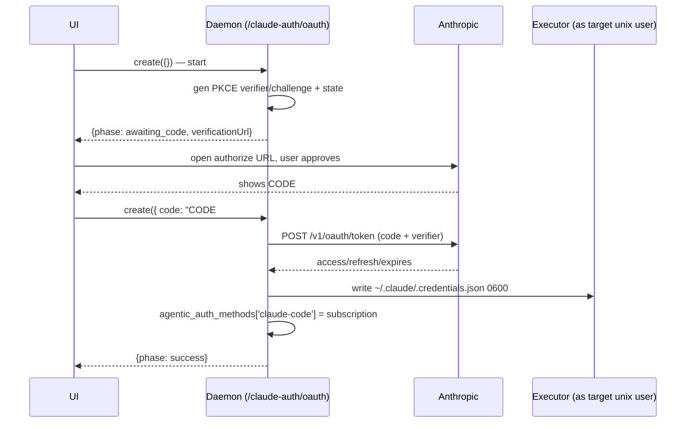

# Claude Code OAuth Sign-In (design spike)

Status: **spike / draft** — design + daemon scaffold, not shipped. Auth code is
sensitive; this doc exists so the design is reviewed before the flow is wired
into production UI.

Goal: let a user sign in with their Claude subscription (Pro/Max/Team/Enterprise)
from the Agor UI — the same capability we already ship for Codex via
`/codex-auth/device` — instead of running `claude setup-token` on a machine with
a browser and pasting a long-lived token into Agor.

The Codex module is the template. Read it first:

- `apps/agor-daemon/src/services/codex-device-auth.ts`
- `apps/agor-daemon/src/services/codex-auth-shared.ts`
- `apps/agor-daemon/src/utils/executor-codex-auth.ts`
- `packages/executor/src/commands/codex-auth-file.ts`
- `apps/agor-ui/src/components/CodexAuth/CodexDeviceSignIn.tsx`

---

## VERIFIED vs ASSUMED

Everything below is split into what was independently verified and what is still
an assumption a reviewer/implementer must confirm before shipping.

### VERIFIED

Sources: the OAuth constants and the credential shape were read directly out of
the **bundled Claude Agent SDK `cli.js` that Agor actually loads**
(`@anthropic-ai/claude-agent-sdk@0.1.55`, via
`loadManagedAgenticToolSdk('claude-code')`) and cross-checked against the
locally installed `claude` CLI (v2.1.211) and Anthropic's official docs
(<https://code.claude.com/docs/en/authentication>).

1. **There is NO device-authorization (RFC 8628) endpoint for Claude Code.**
   The claim "no device endpoint" was treated as something to disprove, not
   assume. No `device_code` / `deviceauth` / device-grant strings exist in the
   bundled SDK `cli.js`; the official authentication doc describes only a browser
   authorization flow with a paste-back code; a detailed binary-analysis writeup
   describes the same. This is the **one structural difference from Codex** — see
   below.
2. **Claude Code uses OAuth 2.0 authorization-code + PKCE (S256) with a
   paste-back code.** Verified constants from the bundled SDK:
   - authorize URL: `https://claude.ai/oauth/authorize`
   - token URL: `https://console.anthropic.com/v1/oauth/token`
     (installed CLI v2.1.211 uses `https://platform.claude.com/v1/oauth/token`
     — console→platform rename is in flight; see open questions)
   - redirect_uri: `https://console.anthropic.com/oauth/code/callback`
     (v2.1.211: `https://platform.claude.com/oauth/code/callback`)
   - client_id: `9d1c250a-e61b-44d9-88ed-5944d1962f5e` — a single fixed public
     client id shared by every Claude Code install
   - PKCE: `code_challenge_method=S256`, plus an OAuth `state` param
   - grant types present: `authorization_code` (initial) and `refresh_token`
     (renewal)
   - the authorize page returns the code as **`CODE#STATE`** which the user
     copies back (this is exactly the `Paste code here if prompted` path the docs
     describe for WSL2/SSH/containers).
3. **On-disk credential format read by the SDK/CLI on Linux:**
   `~/.claude/.credentials.json`, mode `0600` (macOS uses the Keychain; if
   `CLAUDE_CONFIG_DIR` is set the file lives under that dir instead). Shape
   (keys verified present in the SDK: `claudeAiOauth`, `subscriptionType`,
   `rateLimitTier`):
   ```json
   {
     "claudeAiOauth": {
       "accessToken": "sk-ant-oat01-...",
       "refreshToken": "sk-ant-ort01-...",
       "expiresAt": 1748276587173,
       "scopes": ["user:inference", "user:profile"],
       "subscriptionType": null,
       "rateLimitTier": null
     }
   }
   ```
   `expiresAt` is a **Unix epoch in milliseconds**. The token response returns
   `expires_in` (seconds, e.g. `28800` = 8h), `access_token` (`sk-ant-oat01-`),
   `refresh_token` (`sk-ant-ort01-`), and `account`/`organization` objects.

### ASSUMED — confirm before shipping

- **Token endpoint content-type / body encoding.** The scaffold posts a JSON
  body; some community reimplementations use JSON, and the SDK's exact
  content-type was not extracted. Confirm `application/json` vs
  `application/x-www-form-urlencoded` and the exact field names.
- **Exact scope list to request.** The bundled SDK contains `user:inference`,
  `user:profile`, `user:sessions:claude_code`, and `org:create_api_key`; the
  installed CLI additionally has `user:mcp_servers`. `setup-token` and `/login`
  request different subsets. Pull the exact set for the pinned SDK at
  implementation time rather than hardcoding a guess. Requesting too narrow a
  scope silently disables features (e.g. MCP-from-claude.ai); too broad may be
  rejected.
- **Whether an extra authorize param (e.g. `&code=true`) is required** to force
  the code-display page rather than a silent localhost redirect. Community
  scripts append it; not confirmed against the pinned SDK.
- **console.anthropic.com vs platform.claude.com** — which host the fixed client
  id's redirect_uri is currently registered against. A redirect_uri mismatch is
  the most likely first failure.

### CORRECTION to the orchestrator's brief

The brief stated "the SDK PREFERS the credentials.json file [over the env var]".
The **official precedence table currently says the opposite**: env
`CLAUDE_CODE_OAUTH_TOKEN` (rank 5) is chosen **above** the subscription
`/login` credential in `.credentials.json` (rank 7)
(<https://code.claude.com/docs/en/authentication#authentication-precedence>).

This does **not** weaken the design — writing `.credentials.json` is still the
right target, for reasons independent of precedence (below). But the "the file
always wins" premise should not be relied on; the real motivations are refresh
and coherence. See "Why write the file" and open questions.

---

## The one structural difference: paste-back, not polling

Codex has a device-authorization endpoint, so `codex-device-auth.ts` can issue a
user code and then **poll OpenAI daemon-side** until the user approves — the UI
never handles the credential or a code coming back.

Claude has no such endpoint. The flow is:

1. Daemon generates a PKCE `verifier`/`challenge` and a `state`, builds the
   `claude.ai/oauth/authorize` URL, and returns it to the UI.
2. User opens the URL, signs in to Claude, approves, and the Anthropic callback
   page shows a `CODE#STATE` string.
3. **User copies that string back into Agor** (the reverse of Codex: the code
   travels user→Agor, not Agor→user).
4. Daemon splits `CODE#STATE`, checks `state` matches the attempt, exchanges
   `code` + `verifier` at the token endpoint, and writes the credential.

So the service is a **two-call `create`**: first call (no `code`) starts and
returns the authorize URL; second call (`{ code }`) finishes. `find()` reports
status, mirroring Codex's `create`+`find`. There is no daemon poll loop and no
15-minute server-side code lifetime to track — the only clock is our own
`verifier`/`state` freshness window.



---

## Mapping onto the Codex module structure

| Codex                                            | Claude equivalent (this spike)                                                        |
| ------------------------------------------------ | ------------------------------------------------------------------------------------- |
| `codex-device-auth.ts` service (`create`+`find`) | `claude-oauth.ts` service (two-call `create` + `find`)                                |
| device usercode + daemon poll loop               | authorize URL + user paste-back (no poll)                                             |
| server-issued PKCE (returned by poll)            | **daemon-generated PKCE** (we own verifier/challenge/state)                           |
| `buildDeviceAuthJson` → Codex `auth.json`        | `buildClaudeCredentialsJson` → `.credentials.json`                                    |
| `persistVerifiedCodexAuth` (shared)              | inline persist in `claude-oauth.ts` (single caller → no shared module yet, YAGNI)     |
| `resolveCodexUnixIdentity`                       | **reused as-is** (identity resolution is tool-agnostic; see open questions on rename) |
| `writeCodexAuthViaExecutor` / `codex.auth-file`  | `writeClaudeAuthViaExecutor` / `claude.auth-file`                                     |
| `agentic_auth_methods.codex = 'subscription'`    | `agentic_auth_methods['claude-code'] = 'subscription'`                                |
| `CodexDeviceAuthStatus` type                     | `ClaudeOAuthStatus` type                                                              |

Reused verbatim: `resolveCodexUnixIdentity` (unix-identity resolution + hosted
tenant-safe home checks), the executor atomic-write pattern
(temp file → `chmod 0600` → `rename` → read-back verify), and the
`isTenantAgenticToolEnabled` gate.

---

## Why write `.credentials.json` (not just inject the env var)

Agor already supports pasting a `CLAUDE_CODE_OAUTH_TOKEN` (`check-auth.ts`),
which the executor injects as an env var (`spawn-executor.ts`). Writing the
real `.credentials.json` is still worth doing:

1. **Refresh.** `.credentials.json` carries the `refreshToken`, so the CLI/SDK
   auto-renews the ~8h access token. A long-running unattended Agor session
   (agent view, schedules) outlives an 8h access token; the file path survives,
   an injected static access token would not. (`setup-token` mints a ~1-year
   token, but that is a different, coarser artifact than a subscription login.)
2. **Identical to a real `/login`.** The daemon-written file is byte-compatible
   with what interactive `/login` produces, so downstream behavior is the same.
3. **Avoids env↔file conflicts under strict impersonation.** In `strict` mode a
   session runs as the user's own unix account, which may already hold a stale
   `~/.claude/.credentials.json` from a prior interactive login. Injecting an
   env token _and_ leaving a conflicting on-disk file is the kind of split-brain
   that produces confusing 401s. Writing (and owning) the file gives one
   coherent, refreshable credential source. NOTE: because the documented
   precedence currently ranks the env var above the file, the executor should
   **not also inject `CLAUDE_CODE_OAUTH_TOKEN`** for a user authenticated this
   way — otherwise a stale env token would mask the fresh file. This coupling is
   an open question flagged below.

---

## Credential-write path (executor)

Mirrors `codex.auth-file` exactly, so ownership and permissions hold in
insulated/strict modes:

- New executor command `claude.auth-file` (`write` / `delete`), handled by
  `packages/executor/src/commands/claude-auth-file.ts`.
- `resolveClaudeCredentialsPath()` → `${CLAUDE_CONFIG_DIR || ~/.claude}/.credentials.json`.
- Write is atomic and private: `mkdir 0700` → temp file `wx` `0600` →
  `chmod 0600` → `rename` → read-back verify.
- The daemon resolves the target unix identity from the **authenticated user**
  (never from request data) via `resolveCodexUnixIdentity` and runs the command
  _as_ that identity (`asUser`), so the file lands 0600-owned by the right user.

This also fixes the known strict-impersonation gap where subscription auth had
no daemon-driven on-disk path at all (only env injection).

---

## `agentic_auth_methods` flip

On success the service patches the user:
`agentic_auth_methods['claude-code'] = 'subscription'` (the key is `'claude-code'`
per `AgenticAuthMethods = Partial<Record<'claude-code' | 'codex', AgenticAuthMethod>>`;
`AgenticAuthMethod = 'api_key' | 'subscription'`). This is what the tenant
agentic-tool resolver already keys on to select subscription auth for Claude.

---

## Security contract (mirrors the Codex SECURITY CONTRACT)

- The target unix identity is **always derived from the authenticated user**,
  never from request data — callers act only on their own credentials.
- Token material flows browser → daemon → target user's filesystem only. It is
  **never** returned to the UI, logged, echoed, or placed in any agent/LLM
  context. Failures log an error **class**, never token bytes.
- Status responses (`ClaudeOAuthStatus`) carry only non-secret metadata: the
  phase, the authorize URL, an expiry, an optional plan/subscription hint.
- The pasted `CODE#STATE` is a short-lived, single-use authorization code, not a
  credential; it is exchanged immediately and never persisted.
- `state` is verified against the attempt before exchange (CSRF / mix-up
  defense); the PKCE `verifier` never leaves the daemon.
- Writes happen **as** the target unix user (sudo, content over stdin), so 0600
  ownership holds in insulated/strict modes.
- Multi-tenancy: `.credentials.json` is a tenant-owned, per-user derived
  resource. Identity resolution goes through `resolveCodexUnixIdentity`, which
  already fails closed for hosted multi-tenant modes without a
  `persistent-per-user` executor home. The same negative coverage the Codex
  device flow has must be added here.

---

## UI sketch (not built in this spike)

Mirror `CodexDeviceSignIn.tsx` (AntD only, design tokens, no raw CSS), a
memoized self-contained pane, but with a paste-back step instead of a poll:

1. On mount, `create({})` → render `status.verificationUrl` as a `Typography.Link`
   ("Open the Claude sign-in page →") plus a short instruction.
2. Render an AntD `Input` + primary `Button` ("I've approved — paste my code")
   for the `CODE#STATE` string. On submit call `create({ code })`.
3. On `phase: 'success'` show the green check (reuse the Codex success block) and
   fire `onVerified()`. On `expired`/`error` show an `Alert` with a "Start over"
   button that re-runs `create({})`.

Because there is no poll loop, the pane is simpler than Codex's: no 2s status
polling, no countdown driven by a server code lifetime (optionally a local
freshness countdown on our own `expiresAt`).

---

## Open questions

1. **Redirect_uri host + token host**: `console.anthropic.com` (bundled SDK)
   vs `platform.claude.com` (installed CLI). Which is registered for the fixed
   client id today? A mismatch fails the exchange. Track the pinned SDK.
2. **Exact scopes + token-endpoint content-type** (see ASSUMED). Extract from
   the pinned SDK rather than guessing.
3. **Env-var coupling**: since the docs rank `CLAUDE_CODE_OAUTH_TOKEN` above the
   file, must the executor _stop_ injecting that env var for file-authenticated
   users, and does `check-auth.ts` need to prefer the on-disk file? Decide the
   single source of truth to avoid split-brain 401s.
4. **`check-auth` / logout parity**: add a `claude.auth-file` `inspect` op and a
   `/claude-auth/logout` mirroring Codex, so the connection banner and
   disconnect work. Out of scope for this spike.
5. **`resolveCodexUnixIdentity` rename**: it is now used by a non-Codex flow.
   Rename to `resolveAgenticUnixIdentity` (and generalize its Codex-specific
   error strings) in a follow-up; kept as-is here to avoid churn during review.
6. **ToS / acceptable use** (see below).

---

## ToS / acceptable-use considerations (flagged, not resolved)

- The flow drives the **fixed public Claude Code client id** programmatically.
  The user authenticates with **their own** browser + credentials, and tokens
  are stored **per-user** on that user's own unix home — this is the user
  signing into their own subscription, not account sharing. That is materially
  different from one account's token being reused across users.
- Consumer subscription (Pro/Max) tokens driving **automated / high-volume**
  agent work may trip Anthropic's rate-limit or abuse heuristics; that risk
  exists today with pasted `setup-token`s too, but a smoother sign-in may
  increase volume.
- In **hosted multi-tenant** mode, storing another user's subscription tokens
  requires the strict per-user isolation guarantees (the
  `hasTenantSafeExecutorCredentialHome` gate). Do not enable this path in modes
  that can't guarantee per-user credential homes.
- Recommendation: before shipping past spike, confirm with Anthropic (or via the
  Claude Code terms) that daemon-driven `/login`-equivalent sign-in on the
  user's behalf is acceptable, and keep API-key and pasted-token paths as
  first-class alternatives.

```

```
