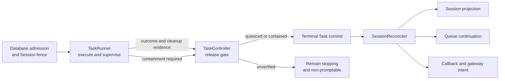

# Task runtime architecture exploration

> **Status:** Discontinued exploration, retained for future reference. This is
> not the current architecture, an approved target, or an implementation plan.
> See [task-runtime-state.md](../concepts/task-runtime-state.md) for current
> behavior; code remains ground truth.

This document preserves the intent behind
[#2090](https://github.com/preset-io/agor/pull/2090), the proposed contract, and
[#2105](https://github.com/preset-io/agor/pull/2105), its first implementation.
The implementation PR is closed, and the architecture is not being adopted now.
The runtime has continued to evolve through smaller changes, several motivating
failures have targeted fixes, and carrying the broad refactor forward would
require revalidating its assumptions and integration surface against current
`main`.

## Proposed architecture

The proposal kept `Task.status` as the only durable execution lifecycle and
split runtime work into three responsibilities rather than requiring three new
classes:

| Responsibility                 | Proposed ownership                                                                                                                                            |
| ------------------------------ | ------------------------------------------------------------------------------------------------------------------------------------------------------------- |
| **TaskRunner (executor)**      | Run the agent adapter, normalize activity, bound waits, cancel work, and report the outcome plus cleanup evidence. It would not write terminal Task state.    |
| **TaskController (daemon)**    | Fence admission, combine completion/Stop/health/exit evidence, verify quiescence or containment, and commit terminal Task state.                              |
| **SessionReconciler (daemon)** | After terminal commit, idempotently repair Session projection, continue the queue, create callbacks, and materialize gateway delivery intent in tenant scope. |

The central rule was that liveness, progress, interaction state, and cleanup
proof answer different questions. A heartbeat or SDK event could initiate
supervision, but only cooperative quiescence or verified containment could
release a Task. Downstream consequences would use deterministic receipts and
remain tenant-scoped; external delivery would stay at-least-once.

## Current behavior that already covers part of the need

Current `main` already has important pieces of the underlying safety model:

- `Task.status` is authoritative, terminal state is immutable, and Session
  status is a projection.
- Database admission and the Session fence prevent two active Tasks for one
  Session; `dispatching` is distinct from an authenticated executor connection.
- Wrapper heartbeats are separate from bounded SDK pulses, and provider event
  vocabulary is normalized before watchdog decisions.
- The daemon termination coordinator owns Stop, startup timeout, lost-heartbeat,
  and enforced-health containment. Unverified cleanup remains `stopping` and
  non-promptable.
- Runtime recovery re-enters tenant scope and fences stale status, heartbeat,
  termination, and settlement evidence.
- Targeted follow-ups have fixed concrete failures, including
  [Stop-to-`stopping` convergence](https://github.com/preset-io/agor/pull/2326)
  and a
  [Claude terminal-path hang](https://github.com/preset-io/agor/pull/2338).

Coverage is still partial. Normal successful completion can be written by the
executor rather than passing through the proposed daemon release gate. Current
`main` has no equivalent of #2105's `reportExecutorSettlement` contract or its
durable `terminal_consequences_completed_at` and
`gateway_terminal_delivery` receipts. Post-progress watchdog coverage also
varies by adapter. The motivating
[#1541](https://github.com/preset-io/agor/issues/1541) and
[#1844](https://github.com/preset-io/agor/issues/1844) issues remain open, so the
discontinuation should not be read as proof that every failure family is solved.

## Ideas worth reusing

- Keep wrapper liveness, SDK activity, meaningful progress, interaction waits,
  and cleanup evidence as separate facts.
- Keep provider-specific event mapping and native deadlines inside adapters.
- Require a precise, fenced proof before releasing admission after
  cancellation or suspected runtime loss.
- Make recovery tenant-scoped, idempotent, and safe to repeat after a crash.
- Use deterministic identities or receipts where duplicate callbacks or
  gateway delivery would be harmful, while documenting at-least-once external
  delivery honestly.
- Reject or bound interactive waits when the launch surface has no responder.

## Rejected direction, deferred parts, and risks

The complete unification from #2105 is not the current direction. Its parts are
deferred rather than approved backlog: daemon-owned settlement for every
outcome, the executor settlement-reporting API, durable terminal consequence
discovery, callback/gateway receipts, comprehensive adapter wait profiles, and
the associated database policies and migrations. These concepts should not be
recovered by rebasing or merging the old branch wholesale.

The implementation crossed executor, daemon, database, gateway, callback, UI,
and documentation boundaries in one change. That breadth increases review and
rollout risk, especially around tenant isolation, competing replicas, stale
settlement evidence, migrations, cleanup that cannot be verified, and
at-least-once delivery. A conservative release gate can also leave a Session
intentionally unavailable, so operator recovery and observability must be part
of any future design.

## When to revisit

Revisit individual parts only when current evidence shows that targeted fixes
are insufficient, for example:

- repeat incidents where normal completion becomes terminal before cleanup is
  safe, or terminal Session/queue/callback/gateway consequences are lost;
- reproducible cross-replica admission or settlement races under PostgreSQL;
- stalled turns across multiple adapters despite the current watchdog model;
- unattended permission waits that cannot be represented safely by current
  launch surfaces; or
- a concrete need for crash-repairable callback or gateway delivery receipts.

A future effort should start from current `main`, current incidents, and the
current-state document. Adopt the smallest independently useful invariant,
define its tenant and failure boundaries, and validate it under the relevant
replica/runtime topology before considering a broader ownership rewrite.
