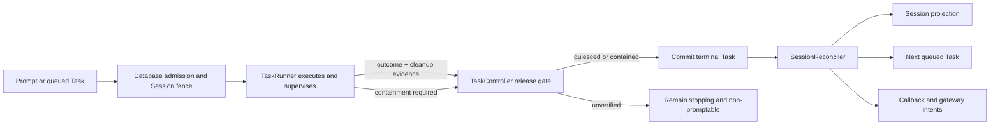

# Desired task runtime architecture

> **Status:** Proposed target contract. This document describes the ownership and
> proof boundaries Agor is adopting; it is not a substitute for current behavior.
> See [task-runtime-state.md](../concepts/task-runtime-state.md) for the current
> system. Code remains ground truth. The first substantial implementation is
> tracked in [#2105](https://github.com/preset-io/agor/pull/2105).

## Decision

Agor keeps one authoritative durable execution lifecycle: `Task.status`. Every
executor-backed turn converges on one daemon-owned release gate:

- the executor reports cooperative runtime quiescence; or
- the daemon verifies containment for the specific runtime.

Only then may the daemon commit terminal Task state and reconcile its
consequences. If neither proof is available, the Task remains `stopping` and
its Session remains non-promptable. An authorized force-fail is an explicit
unsafe logical release, not evidence that the runtime stopped.

The architecture names three responsibilities, not three mandatory classes:

| Responsibility                 | Owns                                                                                       | Does not own                                                      |
| ------------------------------ | ------------------------------------------------------------------------------------------ | ----------------------------------------------------------------- |
| **TaskRunner** — executor      | Adapter execution, bounded waits, normalized runtime evidence, and cooperative cleanup     | Durable Task state, forced containment, or Session reconciliation |
| **TaskController** — daemon    | Admission fences, termination causes, containment, release proof, and terminal Task commit | Raw agentic-tool vocabulary or downstream delivery                |
| **SessionReconciler** — daemon | Session projection, queue continuation, callbacks, and gateway consequence intents         | Runtime observation or containment                                |

## Why this boundary exists

Stalled-session failures combine several different questions:

1. Is the executor wrapper reachable?
2. Is the agentic-tool runtime active?
3. Has meaningful progress occurred?
4. Is it safe to release durable admission?
5. Were Session, queue, callback, and gateway consequences repaired?

A heartbeat cannot answer all five. Runtime activity is not necessarily progress,
and a terminal result is not proof that cleanup finished. The ownership split
keeps these facts separate without creating a second durable lifecycle.

The contract addresses the failure families tracked by issues such as
[#1541](https://github.com/preset-io/agor/issues/1541),
[#1844](https://github.com/preset-io/agor/issues/1844),
[#1900](https://github.com/preset-io/agor/issues/1900),
[#1831](https://github.com/preset-io/agor/issues/1831), and
[#2037](https://github.com/preset-io/agor/issues/2037): false stalls, lost
completion, unsafe release, stale terminal consequences, and waits with no
reachable responder.

## Lifecycle and release

All executor-backed paths use the same shape:

- Database admission preserves one active runtime per Session and queue order.
- Runtime adapters translate tool-specific events into shared evidence; they do
  not write terminal Task state.
- Normal completion, Stop, health failure, timeout, and restart recovery all
  pass through the same release-and-settlement boundary.
- Cancellation without verified cleanup is not terminal success or failure.
- Queue continuation waits for ordered reconciliation of the settled Task.

## Evidence and adapter boundaries

Keep these facts distinct:

- **Wrapper liveness:** the executor can communicate.
- **Runtime activity:** the SDK emitted an event.
- **Meaningful progress:** recognized activity advanced the turn or an operation.
- **Interaction state:** execution is waiting for an authorized responder.
- **Cleanup evidence:** the runtime quiesced or containment was verified.

Agentic-tool adapters own provider-specific event vocabulary and native deadline
configuration. Unknown vocabulary is compatibility evidence, not meaningful
progress and not proof of a stall. An adapter must not broaden tenant, user,
branch, Task, or runtime authority supplied by the host.

## Recovery and cross-boundary rules

### Terminal consequences

After terminal Task commit, a tenant-scoped reconciler repairs the durable
consequences in order:

1. Session projection and attention state;
2. the next queued Task, when the Session is promptable;
3. child-completion callbacks;
4. the originating gateway's terminal delivery intent.

Each consequence uses a domain-specific deterministic identity or receipt so
repeated repair is safe. External delivery remains **at-least-once**; Agor does
not claim exactly-once external effects.

### Tenant boundary

Task, Session, queue, callback, and gateway resources are tenant-owned or
tenant-derived. Startup or background discovery may use only a narrow explicit
system capability. Every subsequent read, claim, projection, callback, queue
action, and gateway intent re-enters the owning tenant scope.

Tenant identity may span orchestration and bounded runtime waits, but a database
transaction must not span process containment, executor RPC, or external I/O.
Recovery for one Session is ordered and single-writer; different Sessions may
recover concurrently.

### Interaction capability

Execution may wait for a human only when the launch surface can return a
matching decision. Interactive UI execution may wait under a deadline. Scheduled
or otherwise unattended work must fail truthfully before creating an
unanswerable waiter, message, or waiting projection. A permission response is
control input for the active Task, not a new queued prompt.

## Required invariants

1. `Task.status` is the only durable execution lifecycle; Session status is a
   projection.
2. Heartbeat, runtime activity, meaningful progress, interaction state, and
   containment evidence remain separate facts.
3. Runtime-specific vocabulary stays inside adapters; adapters do not patch
   durable terminal state or reconcile Sessions.
4. Automatic terminal settlement requires cooperative quiescence or verified
   containment. Otherwise work remains `stopping`.
5. Terminal consequences are tenant-scoped and repairable by deterministic
   identities or receipts.
6. Recovery for one Session is ordered; queue continuation waits for settlement
   and reconciliation.
7. Supervision does not imply automatic retry, prompt replay, or exactly-once
   external effects.
8. Unattended execution cannot create an interaction wait without a reachable
   responder.

## Non-goals

This contract does not introduce:

- a new `Task` status, execution-attempt table, or second lifecycle;
- automatic Task retry, prompt replay, or runtime adoption after restart;
- a persistent runtime-event or operation ledger;
- a generic distributed outbox;
- a general remote-execution kernel;
- an exactly-once external-effects framework.

Those mechanisms require a separately demonstrated need and an explicit design
revision.

## Adoption

The implementation should deepen existing task, executor, termination, queue,
callback, and gateway seams rather than create parallel lifecycle owners. Each
implementation change should identify the invariant it advances, preserve the
current behavior it does not change, and update the current-state documentation
when behavior actually changes.

[#2105](https://github.com/preset-io/agor/pull/2105) is the current runtime
implementation vehicle. This document remains the compact target contract; its
claims should be marked implemented, partial, or deferred as adoption proceeds.
