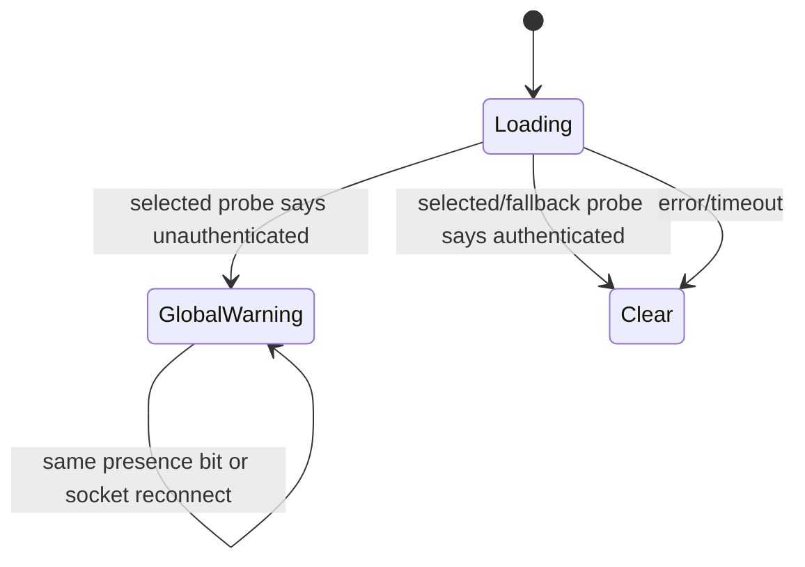
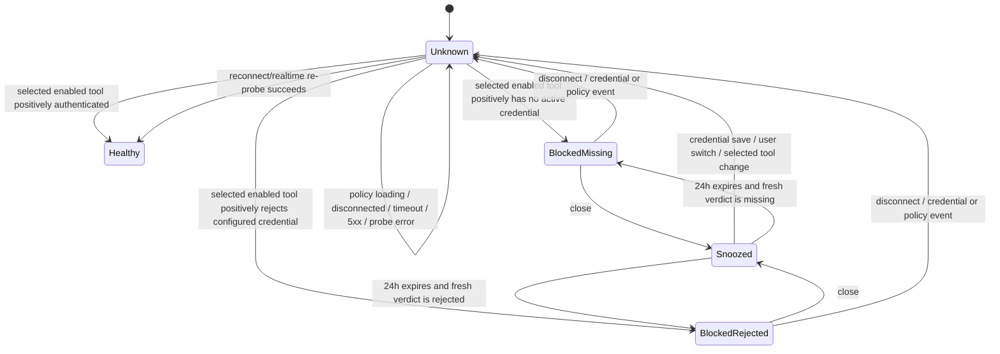

# AI credential status banner: authority and UX contract

Date: 2026-08-29

## Revision inventory

At investigation time:

- Local `main`, `origin/main`, and the branch base were all
  `66ed08618f241b0a28f2c0029a8634a5e3d29bda` (`fix(onboarding): prevent final
modal reopen and restore dismissal (#2595)`).
- `https://agor.sandbox.preset.zone/health` reported Agor `0.25.2`, build
  `6a0074c13`, built at `2026-08-27T06:00:20.945Z`. The unambiguous repository
  commit for that prefix is
  `6a0074c1351f0a6d65540267dc7783b06cf7b258` (`feat(apm): trace postgres.js
queries via Drizzle session shim (#2571)`). The deployed build was therefore
  behind `main`.
- The managed-environment credential hardening referenced in the report is
  `83c5076ee4f3fac5c38250d90753e0901a769aca` (`fix(security): harden managed
environment secrets (#2561)`).

The health endpoint is authoritative for deployment/build identity, not agent
credential health.

## Credential/status authorities

There is intentionally no single persisted `aiCredentialsWork` boolean.
Authority is layered and tool-specific:

| Question                                                         | Authoritative source                                                                                      | Notes                                                                                                                                                                                                      |
| ---------------------------------------------------------------- | --------------------------------------------------------------------------------------------------------- | ---------------------------------------------------------------------------------------------------------------------------------------------------------------------------------------------------------- |
| Which tool will a new session use?                               | `resolveUserPrimaryAgenticTool`, then `resolveAvailableUserAgenticTool` against `AVAILABLE_AGENTS`        | The New Session and navbar creation flows, picker fallback, and shell credential warning share this resolver. Stored credentials do not silently change the selected tool.                                 |
| Is a tool deployed and enabled, and which credential owner wins? | `agentic-tool-settings` plus `TenantAgenticToolSettingsRepository`                                        | Includes deployment availability, workspace enablement, `user_*`/`tenant_*` resolution policy, boolean-only workspace field status, and a durable non-secret revision incremented on every settings patch. |
| Does the user have a provider credential recorded?               | Encrypted `users.data.agentic_tools[tool]` and `agentic_auth_methods`                                     | `apps/agor-daemon/src/services/users.ts` returns field-presence booleans only. Secret fields are never returned. General `env_vars` are not a provider-credential fallback after #2561.                    |
| What complete connection will execution receive?                 | `resolveProviderConnection` / `resolveApiKey`                                                             | `packages/core/src/config/tenant-agentic-tool-resolver.ts` chooses one complete user or workspace connection atomically and honors the selected Claude/Codex auth family.                                  |
| Is the selected resolved credential usable now?                  | Authenticated `POST /check-auth`                                                                          | `apps/agor-daemon/src/services/check-auth.ts` resolves in trusted tenant/user context, then returns `authenticated`, `unauthenticated`, or `unknown`. It does not persist or cache a result.               |
| What does execution really receive?                              | Executor provider-env installation                                                                        | `packages/executor/src/env-sanitizer.ts` removes ambient provider credentials; the resolved connection is installed by the executor launch path. This is the final source for task execution.              |
| Is the daemon/process healthy?                                   | `GET /health`                                                                                             | Process/build health only. It cannot prove any user's provider authentication.                                                                                                                             |
| How does UI state refresh?                                       | `users` and `agentic-tool-settings` realtime events, reconnect hydration, and a fresh `/check-auth` probe | `apps/agor-ui/src/hooks/useAgorData.ts`, `agorRealtimeActions.ts`, `agorStore.ts`, `App.tsx`, and `OnboardingBanners.tsx`.                                                                                 |
| Where can the user act?                                          | User Agent Setup or workspace Agentic Tools settings                                                      | The banner routes according to the effective resolution policy and caller role. It says “open/review settings,” not “reset,” because an outage or unknown result should not encourage credential rotation. |

`/check-auth` status semantics are:

- **authenticated**: positive provider/native evidence (provider 2xx, valid
  native account metadata where reliable, well-formed supported Codex native
  login, or a runtime-managed tool);
- **unauthenticated**: positive blocking evidence (no credential on the active
  policy route, disabled tool, decrypt failure, provider 401/403, or a
  positively missing/malformed native login);
- **unknown**: the daemon could not prove either side (initial/loading state,
  timeout, network error, provider 5xx, delegated inspection problem, or an
  auth class without a reliable negative probe).

Callers must never translate `unknown` into a definitive failure.

## Root cause

Claude has three supported credential fields:

1. `ANTHROPIC_API_KEY` (Anthropic API key, `x-api-key`);
2. `ANTHROPIC_AUTH_TOKEN` (Anthropic SDK bearer token, `Authorization: Bearer`);
3. `CLAUDE_CODE_OAUTH_TOKEN` (Claude subscription/setup-token path).

The atomic resolver already returned the complete connection and the executor
already installed all three correctly. The old `check-auth` code destructured
only `apiKey` from `resolveApiKey('ANTHROPIC_API_KEY', ...)`, then separately
looked for the subscription token. It ignored
`connection.ANTHROPIC_AUTH_TOKEN`. A user with a working bearer connection
therefore received:

```text
POST /check-auth { tool: "claude-code" }
→ unauthenticated: No usable ANTHROPIC_API_KEY ...
```

while an actual Claude task received the bearer token and succeeded. The UI
combined the boolean presence of that bearer field with the false daemon
verdict and produced the old global copy:

```text
Your AI credentials aren't working. Sessions will fail until you reconnect.
```

Production-safe evidence confirmed the mismatch without reading a secret:

- Max's self DTO exposed only `ANTHROPIC_AUTH_TOKEN: true` for Claude;
- the workspace Claude route exposed no configured workspace credential;
- deployed `/check-auth` returned `unauthenticated` and specifically claimed
  `ANTHROPIC_API_KEY` was absent;
- a recent Claude Sonnet task for the same user/route completed successfully on
  the deployed revision.

That makes the bearer-field omission the direct root cause with high
confidence. It also shows why checking only “configured” or only one canonical
key name is not an execution-health verdict.

The banner had secondary stale/global defects:

- it probed one preferred tool but described all “AI credentials”;
- its no-key fallback could let another agent's status decide the selected
  agent's global result;
- it counted legacy/general managed env-var presence even though #2561 removed
  those values from provider resolution;
- same-field credential rotations keep the same public `true` presence bit, so
  the probe effect could remain stale after a realtime patch;
- the selected-tool fallback order was independently duplicated and could drift
  from the New Session picker;
- reconnect did not explicitly reset the verdict to `unknown` and re-probe;
- workspace policy could still be loading when the first probe ran;
- there was no dismiss control.

There is no daemon auth-result cache to invalidate and no replica-local status
record. In PostgreSQL HA the resolver reads tenant data on the serving replica;
socket reconnect hydration plus a new stateless probe is the UI consistency
mechanism. SQLite is a single-daemon deployment. Provider and database
timeouts remain `unknown` rather than being cached as a rejection.

### Model-history audit

The global banner/copy originated in
`a0646ced58623dec1e1953af7c1ad82281f610cf` (#1742) and its bounded native
fallback in `e32def0b1aa245ba726eb7cc7237b8f13bf5b255` (#1862). Those assumptions
predate the Claude setup-token flow
(`7fdd146d1d7010fb959abe2a154974b5a91d0f99`, #1867), Codex ChatGPT import
(`2e691849586f302b0109daae685491bafd9f9d10`, #1954), durable/HA Codex identity
(`a44bba086dafd01a4504a8a693725ec2eaaa7bfa`, #2521, and
`5d19fbc6d72f36c9672010396510b35f1f8afbb9`, #2575), and provider-scoped
managed-secret hardening (#2561). The old global boolean and “reconnect AI”
wording were therefore remnants of an older one-key model.

Secure local password assignment
(`0738c71ca612be89c90385b0bf83d4d6f447e97f`, #2538) and external/cloud Agor
identity govern access to the daemon; they are not provider credentials and
must not affect this banner. Delegated/cloud execution identity matters only
when a native credential lives in that execution home. Inspection errors on
that route remain `unknown`, not a global provider failure.

## Before and after state machine

### Before



The fallback and copy collapsed multiple tools, and no user transition existed
out of `GlobalWarning` except a later dependency-changing probe or page reload.

### After



Only the selected enabled tool is probed. Another tool's failure does not
create this warning; another tool's success does not claim the selected tool
can run. If the selected tool is disabled, the first enabled tool is selected;
if no tool is available, a credential-failure banner is not shown. Workspace
policy hydration is a prerequisite, so startup does not guess.

“Selected” is the same effective tool as session creation: the persisted
primary tool (or Claude default), followed by the first enabled entry in
`AVAILABLE_AGENTS`. Credential presence and an old per-tool onboarding config
do not silently replace that selection. This also keeps OpenCode ahead of the
beta Cursor/Copilot fallbacks when earlier tools are disabled.

New copy identifies the affected tool:

- missing: **“Claude Code isn't connected. New Claude Code sessions won't run
  until you configure it.”**
- rejected: **“Claude Code rejected the configured credential. New Claude Code
  sessions will fail until you update it.”**

The action opens or reviews that tool's user/workspace settings. When the
active route is workspace-owned and the caller is not an administrator, the
remediation follows policy rather than ownership alone: `tenant_required` and
an active `tenant_preferred` credential explain that a workspace admin must
act, while `user_preferred` offers personal settings because a new personal
credential takes precedence over the rejected workspace fallback. The close
button has an agent-specific accessible name and snoozes the warning for 24
hours. Persistence is local-browser, versioned, and scoped by user ID plus
tool. Expired/malformed values are removed. A local credential save clears the
snooze immediately; a durable workspace revision does the same for workspace
rotations, including same-field replacements whose public presence stays
`true`. Storage events synchronize snooze/clear state across tabs. A different
user or selected tool never inherits it. If storage is unavailable, only the
current mount is snoozed, so persistence failure cannot hide a continuing error
indefinitely.

## Deterministic reproduction and request/event sequence

The managed SQLite regression uses only synthetic values:

1. Create a user in an isolated migrated SQLite database.
2. Store an encrypted synthetic `ANTHROPIC_AUTH_TOKEN` in the user's
   `claude-code` provider bucket (and separately test a synthetic workspace
   bearer connection under `tenant_required`).
3. Run `check-auth.create` inside a trusted tenant context.
4. Mock only the provider boundary and assert `/v1/models` receives the same
   Bearer authentication shape as the Anthropic SDK.
5. Return provider 200, 401, and transport failure to prove
   `authenticated`, `unauthenticated`, and `unknown` respectively.
6. Assert the service result contains no synthetic credential.

The UI/component sequence is:

```text
authenticate/hydrate user (boolean field status only)
→ hydrate agentic-tool-settings
→ choose selected enabled agent and active owner
→ POST /check-auth for exactly that agent
→ Unknown while in flight
→ render only on a positive authenticated/unauthenticated verdict
→ users patched / agentic-tool-settings patched / local save / reconnect
→ reset Unknown and issue a fresh selected-agent probe
```

Every workspace agentic-tool patch increments a generation stored atomically
with the encrypted settings JSON. The public DTO exposes only that number and
field-presence booleans. Realtime upserts and reconnect hydration therefore
carry the same durable revision across replicas without revealing a credential.
An older in-flight probe is cancelled when the revision changes.

Focused component tests cover valid configured Claude, rejected/expired Claude,
loading/unknown, another-agent-only failure, policy-loading and disabled-agent
states, creation-order fallback, reconnect success and failure, same-field user
and workspace realtime rotation (settled and in-flight), logout and user switch,
snooze persistence/expiry, cross-tab synchronization, and snooze invalidation
after save.
Real-browser coverage runs the warning at desktop, tablet, phone, and short
landscape viewports and exercises keyboard focus and the close action. Synthetic
provider hints are asserted absent from the DOM.

## Security and tenancy review

- Server authorization and tenant context are unchanged. `check-auth` still
  requires the authenticated Feathers path and calls resolution under
  `getCurrentTenantId()` / `runWithTenantDatabaseScope` with the actual user ID.
- Credential encryption, redacted user DTOs, and provider-env sanitization are
  unchanged.
- No result, event, DOM text, or new log contains a credential. Provider secrets
  exist only in the in-memory outbound provider request as before.
- The complete connection continues to come from exactly one policy-selected
  owner; fields are not combined across users, tenants, or credential families.
- The new localStorage record contains only version, user ID, tool name, and an
  expiry timestamp.

## Rollout, rollback, and residual risk

This is a code-only rollout with no schema/config migration. Legacy encrypted
workspace settings read as revision `0`; their next patch atomically persists
revision `1`. Existing browsers have no snooze record and will see a real
selected-agent rejection normally.
Monitor `/check-auth` status mix/provider latency and credential-related session
start failures by tool; do not log credentials or request headers.

Rollback is a normal code revert. The namespaced localStorage entries are
harmless if old UI code ignores them and expire after 24 hours. The daemon and
UI portions should preferably roll out together: the UI changes improve copy
and staleness, but only the daemon change fixes Claude bearer validation.

Residual risks:

- a provider may change its health endpoint/auth semantics; non-401/403
  responses deliberately remain `unknown` rather than accusing the credential;
- Claude subscription account metadata is not a reliable negative signal, so
  missing metadata remains `unknown` and the next real task is the ultimate
  validation;
- Codex ChatGPT login is intentionally not launched by the persistent shell
  probe; its cheap result remains `unknown` until an explicit native validation
  or task start;
- generic `users.updated_at` is the available realtime revision, so an unrelated
  self-profile update can cause one extra bounded probe. It is safe but could be
  replaced later by a non-secret credential revision emitted by the daemon;
- a provider can accept `/v1/models` and still reject a later model/task for a
  quota or model-specific reason. That is a task error, not proof that all
  credentials are disconnected.
