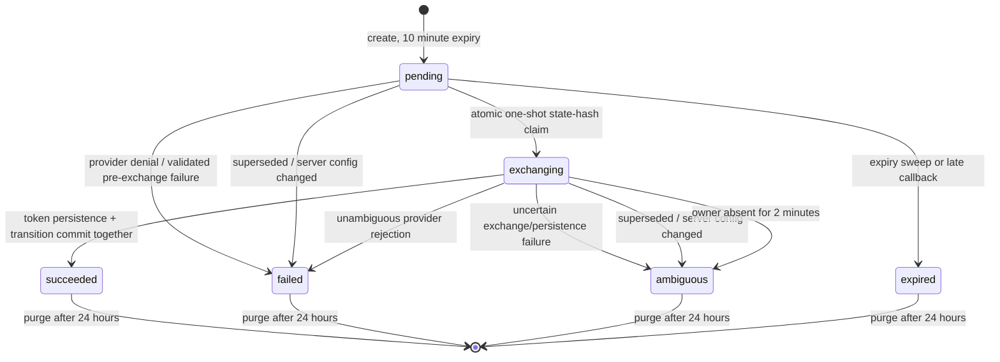

# MCP OAuth pending-flow HA contract

Date: 2026-08-09

## Scope and resource classification

This design covers browser-based MCP OAuth authorization-code flows when Agor
uses PostgreSQL and requests/callbacks can land on different daemons.

| Resource                                           | Ownership                                      | Authority                                                    | Redis disposition                                                       |
| -------------------------------------------------- | ---------------------------------------------- | ------------------------------------------------------------ | ----------------------------------------------------------------------- |
| Pending authorization attempt                      | Tenant-owned, user-initiated, MCP-server-bound | PostgreSQL `mcp_oauth_pending_flows`                         | Never stored                                                            |
| Raw OAuth `state`                                  | Short-lived bearer capability                  | Browser/request only; PostgreSQL stores SHA-256              | Never stored                                                            |
| PKCE verifier, attempt client ID/secret, endpoints | Secret-derived pending material                | AES-GCM sealed envelope using `AGOR_MASTER_SECRET`           | Never stored                                                            |
| Dynamic client registration and credentials        | Tenant/server/config-generation authority      | PostgreSQL `mcp_oauth_client_registrations`; sealed material | Never stored                                                            |
| Provider authorization code                        | Single-use provider capability                 | Callback request only                                        | Never stored                                                            |
| Access/refresh token and grant client credentials  | Tenant/server/credential-subject grant         | OAuth-specific AES-GCM envelopes in `user_mcp_oauth_tokens`  | Never stored                                                            |
| Completion notification                            | Tenant-qualified UX hint                       | Native Socket.IO room                                        | Fanout is allowed only after tenant room isolation; never authoritative |

The pending and grant tables are **non-portable tenant state**. Tenant deletion
removes them, but export/import omits them: restoring an in-flight external
capability is unsafe, and grant ciphertext is bound through AAD to the source
tenant/server/generation and deployment master secret. Re-home and
cross-deployment imports restore MCP server configuration but require OAuth
reauthorization.

Standalone/SQLite keeps the process-local attempt Map and performs DCR in the
initiating daemon. It consumes an attempt before provider exchange and exposes
the same non-replayable failed/ambiguous UI outcomes. SQLite intentionally has
no client-registration table: durable DCR authority is PostgreSQL/HA-only.

## Persisted contract

PostgreSQL stores:

- trusted `tenant_id`, authenticated `user_id`, saved `mcp_server_id`, and
  `oauth_mode`;
- a public-safe `attempt_id` for authenticated status reads;
- `SHA-256(state)`, never raw state;
- expiry and lifecycle timestamps;
- one opaque exchange claim ID;
- a monotonically allocated grant generation and one durable current attempt
  per `(tenant, subject, server, mode)`;
- a versioned HMAC configuration fingerprint covering server ID/URL, transport,
  auth and compatibility modes, client configuration, protected resource,
  issuer, metadata and OAuth endpoints, and callback URI;
- a sealed envelope containing the duplicated binding plus PKCE verifier,
  client credentials, redirect URI, and exchange endpoints.

Composite foreign keys require the user and MCP server to belong to the stored
tenant. Decryption verifies that every duplicated binding still equals the row
before provider exchange. PostgreSQL deployments require a shared
`AGOR_MASTER_SECRET`; plaintext encryption fallback is refused.

The table deliberately has no authorization-code, access-token, refresh-token,
bearer-token, or authorization-URL column. Terminal transitions clear the
sealed envelope.

PostgreSQL DCR uses a separate durable authority because registration precedes
creation of a browser attempt. `mcp_oauth_client_registrations` binds the
tenant, saved MCP server, server config generation, public redirect URI,
registration endpoint/source, metadata URL, protected resource, issuer,
authorization/token endpoints, compatibility and DCR policies, requested
scope, and registration request policy into an HMAC fingerprint. It stores
client ID/secret only inside an OAuth-purpose AES-GCM envelope whose AAD also
binds the UUIDv7 registration row ID. A partial unique index
permits one current registration per tenant/server, and composite foreign keys
prevent cross-tenant attachment.

One database-time lease owner may dispatch DCR. It marks `dispatched_at` before
the provider POST and publishes credentials only through an exact claim ID,
claim generation, exact registration ID, current-row, and status CAS. An
expired undispatched lease is reclaimable without provider duplication. An
expired dispatched lease is `ambiguous`—the provider may have allocated a
client—and a new generation is created. Configuration changes supersede the
current generation and clear its ciphertext. A live exact registered generation
is reused across replicas until its recorded secret expiry. Claim admission
locks and matches the saved server's config/reset epoch before it can observe or
replace a registration, so a pre-reset start cannot disturb a post-reset DCR
generation.

## State machine

The unauthenticated callback enters only the narrow
`mcp_oauth_callback` system capability. Before data access it binds
`agor.oauth_state_hash` transaction-locally. RLS requires both the system
capability and an exact fingerprint match. Authenticated manual completion uses
normal tenant/user scope. At most one caller can transition `pending` to
`exchanging`.

`oauth-start`, manual completion, discover, and browser-flow test endpoints
carry tenant identity but do not hold an HTTP-long database transaction. The
claim transaction commits **before** provider network I/O, so daemon death
cannot roll the state back to replayable `pending` after the provider might
have consumed the code.

## Crash truth table

| Crash/failure point                                                                  | Durable result                                                                                   | User action                                     |
| ------------------------------------------------------------------------------------ | ------------------------------------------------------------------------------------------------ | ----------------------------------------------- |
| Before pending insert commits                                                        | No attempt is returned                                                                           | Start again                                     |
| After pending commit, before callback                                                | `pending`; any daemon can handle callback until expiry                                           | Continue sign-in or restart after expiry        |
| Callback claim loses concurrency race                                                | Existing `exchanging`/terminal result; no second exchange                                        | Wait for durable status                         |
| Provider returns a well-formed OAuth token error on HTTP 400/401                     | `failed`                                                                                         | Start a new sign-in                             |
| Transport failure, bare/non-protocol 4xx, provider 5xx, or unusable success response | `ambiguous`                                                                                      | Start a new sign-in; do not replay old code     |
| Daemon dies after claim, before/during provider exchange                             | `exchanging`, then `ambiguous` after 2 minutes                                                   | Start a new sign-in                             |
| Provider may consume code, daemon dies before token persistence                      | `exchanging`, then `ambiguous`                                                                   | Start a new sign-in; old code is never replayed |
| Token row + `succeeded` transaction commits, callback response is lost               | `succeeded`; duplicate callback/status read is idempotent                                        | Close provider tab; UI refetch converges        |
| Database transaction fails after provider returns a token                            | No token row; `ambiguous` when transition succeeds, otherwise stale exchange ages to `ambiguous` | Start a new sign-in                             |

For DCR, death before `dispatched_at` leaves a safely reclaimable lease. Death
after dispatch produces an `ambiguous` tombstone after lease expiry; a peer
registers a fresh UUIDv7 row and a late owner cannot publish. A well-formed
provider HTTP rejection is `failed`. Transport/timeouts or malformed success
after dispatch are `ambiguous`. Agor does not claim it can revoke an orphan
registration when the provider offers no safe deletion contract.

Each browser attempt records the exact UUIDv7 registration ID whose client it
used. An exact `invalid_client` or `unauthorized_client` OAuth response on a
400/401 token exchange (or the equivalent structured provider failure) CAS-
invalidates only that current row, allowing the next start to register anew.
That evidence must come from Agor's pinned server-to-server token request after
state, issuer, and live authority validation. A browser/front-channel
`error=invalid_client` or `error=unauthorized_client` is unauthenticated input:
it fails and consumes only the state-bound attempt, even for a now-demoted
initiator or a shared server, and never changes fleet DCR authority. Network
errors and other ambiguous provider failures likewise never invalidate a client.
An administrator may invoke `mcp-servers/oauth-client-registration-reset` for a
saved server before callback completion; the tenant-scoped operation rechecks
and row-locks current admin authority after acquiring the grant-configuration
lock. It advances the saved server config generation as a shared reset epoch,
then retires pending attempts, grants, and the current registration. A start
publishes its pending attempt only after taking that same grant lock, matching
the reset epoch, and row-locking the exact current registered-client UUID.
Consequently a pre-reset DCR result cannot publish after reset, including when
its provider request was already in flight, and the next reconnect resolves a
fresh client. DCR lease transactions never acquire the grant lock; reset and
attempt publication order the grant lock before registration row locks, so the
two authorities have no reverse advisory-lock order.

There is intentionally no “recover provider code” path. OAuth providers may
consume authorization codes once, and Agor cannot prove whether an interrupted
exchange did so. `ambiguous` is a safety state, not an implementation error to
paper over with retry.

The server fingerprint and current-attempt generation are revalidated before
exchange and again in the token-success transaction. A newer attempt, current
role downgrade, or relevant server/auth mutation makes that transaction fail;
an older account/provider selection cannot overwrite a newer one.

## Standards and egress posture

Strict current MCP OAuth behavior is the default. It requires exact protected
resource metadata binding, the RFC 8707 `resource` parameter on authorization,
code exchange, and refresh, exact RFC 8414 issuer validation, advertised PKCE
`S256`, and RFC 9207 response issuer validation. OAuth endpoints require HTTPS;
exact localhost/loopback HTTP is a standalone development exception.

One reusable outbound primitive resolves every destination, rejects private,
loopback, link-local, transition/tunnel, documentation, and metadata addresses,
pins the validated address at socket connection time, and revalidates each
redirect. Secret-bearing POST requests never follow redirects.

Non-compliant providers require the narrow per-server
`oauth_compatibility_mode: legacy` opt-in. DCR policy remains explicit outside
reviewed canonical Catalog installs; pre-registration is preferred. DCR
responses must contain a nonempty client ID, the exact redirect URI, and a
compatible token authentication method. PostgreSQL never uses the core
process-global DCR cache: the durable registration authority is the only reuse
path.

DCR is a compatibility client-resolution method, not the lifecycle boundary.
Configured clients and DCR both pass through `resolveOAuthClient` and then use
the same PKCE, durable attempt, callback, exchange, grant, and refresh logic.
A future standardized client-resolution method can join at that boundary; this
change intentionally does not speculate about or implement CIMD.

## Token and UI behavior

The daemon no longer reads or writes the authorization-code token Map keyed by
MCP origin. That namespace did not include tenant, server, user, or shared-mode
subject and could return one grant to another same-origin configuration.
PostgreSQL/SQLite token rows are the daemon authority. PostgreSQL daemon paths
also bypass the separate process-local client-credentials bearer cache;
standalone caching hashes the complete credential/grant configuration and a
trusted caller namespace. The legacy authorization-code Map remains available
only to standalone CLI flows.

The authorization URL is returned on the authenticated start response. Legacy
blocking discover/test calls receive it only on the exact initiating socket;
it is never sent to a user, tenant, or global room. Raw state is never emitted
as a separate realtime field. Completion/disconnect events use
`tenant:{tenant}:user:{user}` for per-user grants and
`tenant:{tenant}` for shared grants. Login, logout, and auth replacement manage
those native rooms.

Realtime remains UX-only. The browser polls the authenticated
`/mcp-servers/oauth-attempt-status/:attempt_id` resource and, on a realtime
hint, refetches `/mcp-servers/oauth-status` plus the MCP server. Missing an
event, reconnecting to a different daemon, or Redis fanout loss cannot change
the correctness result.

PostgreSQL refresh is fleet-coordinated. A database-time transaction claims an
idle grant, increments `refresh_generation`, and records a random claim ID.
Provider I/O happens outside that short transaction; peers observe the committed
row instead of reusing a rotating refresh token. Completion, `invalid_grant`
deletion, and error release require the exact grant generation, refresh
generation, and claim ID. A losing `invalid_grant` cannot delete a newer row.
A refresh owner stale for two minutes becomes `ambiguous`; its rotating token is
never replayed.

PostgreSQL access, refresh, grant client ID, and grant client secret fields use
OAuth-specific versioned envelopes and AAD bound to tenant, subject, server,
generation, and field. SQLite preserves standalone behavior. The
admin-configured `oauth_client_secret` inside MCP server JSON remains under the
existing MCP configuration storage contract; do not claim all MCP server
configuration is encrypted at rest.

Shared grants are a workspace authority in v1: current admin status is required
to start, complete, replace/refresh, or disconnect them. Callback completion
reloads the user role; possession of `state` is insufficient after a downgrade.
Per-user grants remain self-service. Disconnect removes Agor's local row only;
it does not invoke provider revocation.

## Cleanup and retention

Every daemon may run the idempotent PostgreSQL maintenance operation:

- due `pending` attempts become `expired`;
- `exchanging` attempts older than two minutes become `ambiguous`;
- terminal tombstones older than 24 hours are deleted.
- expired DCR leases become `failed` before dispatch or `ambiguous` after it;
- expired DCR client secrets become `expired`, and DCR tombstones older than 24
  hours are deleted.

RLS exposes only eligible inputs (plus expired/ambiguous outputs created at the
same transaction-local database time) under the `mcp_oauth_maintenance`
capability. The sweep contains no provider call and never logs sealed material
or database error detail.

## Rollout

1. Confirm every daemon uses the same stable `AGOR_MASTER_SECRET`. There is no
   OAuth keyring. Drain pending/exchanging attempts before rotation. Because
   grants are also encrypted, changing the secret makes existing grants
   unreadable and requires an explicit reconnect plan; it also affects other
   credentials protected by the deployment master secret.
2. Stop every daemon and take a database backup. Migration `0078` is an
   enforced offline cutover: normal startup and ordinary migration runs refuse
   it on an existing PostgreSQL database. Run
   `agor db migrate --offline-cutover`. It deletes legacy OAuth grant rows
   because plaintext/unfenced rows are structurally incompatible; users must
   reconnect.
3. Apply PostgreSQL migrations through
   `0102_oauth_authority_watermark_reconciliation` before OAuth activation. Do
   not canary or mix old/new cohorts: old constrained-HA daemons keep OAuth
   gated and do not implement the final DCR authority. `0102` also repairs
   databases that ran old PR head `b0585d76`, whose DCR migration collided with
   the final timestamp-only watermark: it creates the skipped Claude authority,
   discards the incompatible generation/sequence DCR authority so reconnect
   registers a fresh client, and recreates the final UUID/CAS table. Its later
   ledger watermark makes pre-final daemons reject the database as ahead. Start
   only the new cohort after migrations complete; rollback requires the
   pre-cutover backup.
4. Resume OAuth and verify cross-daemon callback and rotating refresh.
5. Monitor stable categories/statuses only. Never log state, code, endpoints,
   provider bodies/descriptions, PKCE, client credentials, or tokens.

PostgreSQL OAuth requires a saved MCP server so tenant/server/mode binding is
authoritative. Inline transient flows remain standalone/SQLite-only.

The Catalog rename remains backward compatible at the browser and DTO
boundaries. Exact `/marketplace`, `/marketplace/catalog`, `/marketplace/servers`,
`/marketplace/sessions`, and `/marketplace/credentials` bookmarks redirect to
their `/catalog*` equivalents without starting the Workspace runtime. The
credential projection retains its original coarse `status` values and adds the
optional `detail_status` field for refreshable/refreshing/reconnect UI states;
older clients therefore do not receive an unknown status enum.

## Rollback

1. Pause OAuth starts and stop the whole cohort.
2. Treat remaining `exchanging` attempts as ambiguous. Rollback cannot make a
   provider code replayable.
3. Restore the pre-cutover database backup before starting the prior binary.
   An old daemon can write plaintext, generation-zero grants against the new
   columns, so it must not run on the cutover database.
4. Start only the prior cohort. Authorizations completed after the backup may
   require reconnect.

There is no rolling downgrade. Keeping the forward schema is safe only while
the new binary stays deployed; destructive cleanup needs a separate migration.
