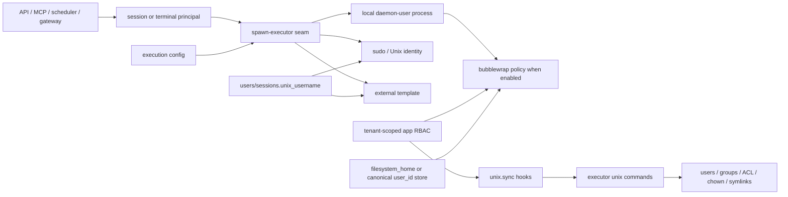

# Unix impersonation deprecation plan

**Status:** Revised for an accelerated pre-1.0 removal  
**Scope baseline:** `main` after PR #2362  
**Authoritative brief:** `agor://kb/agor-cloud-team/architecture/unix-impersonation-deprecation-planning-brief.md`

> Production already runs in sandbox mode. The objective is to remove the legacy surface before the
> upcoming security review, not preserve it through a long deprecation program.

## Executive recommendation

Take a deliberate pre-1.0 break. Cut `0.24.8` from the current known
state, then make `0.25.0` support only `simple`, `sandbox`, and `delegated`. Delete `strict`,
`insulated`, host Unix users, POSIX branch/repository groups, ACL repair, sudo impersonation, and
their CLI/UI/daemon machinery in one coordinated removal PR. Do not spend the week designing a new
configuration taxonomy first.

For `0.25.0`, keep the existing execution surface deliberately small:

```yaml
execution:
  unix_user_mode: sandbox # simple | sandbox | delegated
  # executor_command_template: ... # external substrate; delegated when it needs per-user identity
```

The key name is imperfect, but renaming it while removing its implementation would add churn and
risk. Revisit a clearer substrate/isolation model after the security review. `simple` explicitly
means trusted daemon-user execution. `sandbox` is the fail-closed Linux bubblewrap policy.
`delegated` remains the escape hatch for an explicitly configured external substrate; a command
template alone must not be presented as proof of isolation.

Keep `users.unix_username` and `sessions.unix_username` in `0.25.0`. Production currently needs a
stable, tenant-local home selector, and the immutable session stamp prevents an existing session
from silently changing homes. Treat the value as an opaque **home key**, despite its legacy name;
do not create a host account from it. The effective namespace is `(tenant_id, unix_username)` and
the canonical store is `<tenant-root>/homes/<unix_username>`. Keep `users.filesystem_home` as the
explicit override for migrated homes. A later release can rename/generalize these concepts once the
old machinery is gone.

Do not silently downgrade sandbox to simple mode on non-Linux or when bubblewrap is unavailable.

This is a reasonable aggressive change because the project is pre-1.0, the affected modes were
experimental and operationally brittle, production has already migrated, and reviewing dead sudo/
ACL machinery would consume scarce security-review time. Mitigate it with a frozen transition tag,
an explicit migration recipe, prominent release notes, startup refusal rather than partial legacy
behavior, and a narrow rollback path to the latest `0.24.x` bridge release.

## 1. Current architecture and dependency map

### Configuration and mode resolution

`UnixUserMode` currently contains `simple | delegated | insulated | strict | sandbox` in
`packages/core/src/config/types.ts`. `resolveEffectiveConfig` makes `sandbox` imply RBAC, enabled
per-user sandboxing, and fail-closed availability. `resolveExecutionSecurityMode` separately derives
app RBAC, impersonation, POSIX filesystem projection, group refresh, daemon-user requirement, group
initialization, and username requirement. This is useful centralization, but the source enum mixes
three independent concepts:

1. process substrate (local subprocess or `executor_command_template`),
2. local containment (none or bubblewrap), and
3. execution identity (daemon user, dedicated Unix user, per-user Unix account, or an unverified
   external mapping).

The sandbox is rejected with a template or `executor_unix_user`. `delegated` requires
`unix_username`, does no local sudo/group work, and passes that value to a template when present.

### Spawn paths

`apps/agor-daemon/src/utils/spawn-executor.ts` is the common substrate seam for prompt executors,
interactive terminals, and one-shot executor commands. It currently contains four concerns:

- local `node ... --stdin` spawning and process-group containment;
- `sh -c` template launching;
- `sudo -n -u` wrapping, environment-file preparation/cleanup, and group refresh;
- bubblewrap wrapping of eligible local agent/terminal processes.

Sandbox wrapping applies to local non-impersonated agent and terminal spawns with a branch cwd.
Daemon-internal bounded one-shot commands are intentionally not automatically sandboxed. Template
variables include trusted `{tenant_id}` and `{user_id}`, plus Unix-shaped `{unix_user}`,
`{unix_user_uid}`, and `{unix_user_gid}`.

`register-services.ts`, `terminals.ts`, and read/file/git helpers resolve `asUser`. In strict mode it
is the session/terminal user's Unix name; in insulated mode it is `executor_unix_user`; in delegated
template mode it is only a reported template identity. Git operations can sudo back to the daemon
user solely to refresh supplemental groups.

### Identity persistence and propagation

- `users.unix_username` is editable/admin-managed and is also accepted from launch-auth claims.
- `sessions.unix_username` is stamped at creation and intentionally immutable. It prevents a later
  user rename from silently moving an existing resumable SDK session to another OS identity/home.
- direct sessions, forks/spawns/subsessions, scheduler-created sessions, zone triggers, gateway
  paths, and MCP paths contain explicit username validation or stamping logic.
- legacy session sharing may deliberately inherit the parent identity; the safe path attributes a
  child to the caller. This behavior must continue to use immutable Agor principals, not a mutable
  external mapping.
- launch auth currently upserts `claims.unix_username`; Cloud therefore has a live compatibility
  dependency even though the claim is not itself proof of isolation.

### Filesystem authorization

Application RBAC is authoritative. In legacy modes it is projected into persisted branch/repo
`unix_group` names, POSIX memberships, ownership/mode/ACL state, and per-user branch symlinks.
Hooks dispatch `unix.sync-branch`, `unix.sync-board`, and `unix.sync-user` after ownership, grant,
membership, board, and user changes. Branch/repo creation and deletion also create/delete groups and
repair permissions.

In sandbox mode, the daemon instead computes a principal's `write | read | none` branch access and
translates it into bind/ro-bind/no mount. The home overlay is selected from
`users.filesystem_home`, otherwise a canonical tenant-scoped path keyed by `user_id`. The sandbox
masks sibling homes, daemon state, and external data roots. This is the target local authorization
model.

### Host Unix implementation

`packages/core/src/unix/` owns username validation/generation, sudo execution, user/group command
construction, group UUID migration, POSIX membership reconciliation, home preparation, ACL/mode and
ownership repair, and user-home branch symlinks. `packages/executor/src/commands/unix.ts` exposes
privileged lifecycle commands through executor service tokens. `docker/sudoers/agor-daemon.sudoers`
authorizes the necessary commands. User hooks optionally synchronize web passwords to `chpasswd`.

### Dependency diagram



The desired deletion is `U + H + E + P`, not RBAC, tenant context, the local spawn seam, or sandbox
mount-policy translation.

## 2. Complete inventory and classification

### Remove

| Component                                      | Disposition                                                                                                                                                                                                           |
| ---------------------------------------------- | --------------------------------------------------------------------------------------------------------------------------------------------------------------------------------------------------------------------- |
| `strict`, `insulated`, and their mode branches | Remove in `0.25.0`; refuse old values at startup.                                                                                                                                                                     |
| `executor_unix_user`, `sync_unix_passwords`    | Remove config, env aliases, validation, warnings, hooks, docs, and tests.                                                                                                                                             |
| sudo impersonation in `spawn-executor.ts`      | Remove `asUser`, env files, `sudo -u`, cleanup-as-user, logs, and tests. Preserve ordinary env filtering and process containment.                                                                                     |
| group-refresh sudo wrappers                    | Remove `git-impersonation.ts` and equivalent read/probe indirection; execute trusted daemon operations directly.                                                                                                      |
| `packages/core/src/unix/` host-management code | Remove group manager, integration service, run-as-user, user env files, symlink manager, group UUID migration, and host-user portions of user manager. Move any generally useful input validation only if still used. |
| executor `unix.*` commands                     | Remove registrations, payload types/scopes, token allowlists, hooks, and lifecycle/security tests.                                                                                                                    |
| POSIX projection hooks                         | Remove all `unix.sync-*` dispatch and group initialization/deletion/permission-repair hooks while retaining RBAC cache invalidation and authorization hooks.                                                          |
| user creation/password/lock/delete workflows   | Remove host-account generation, `chpasswd`, `useradd/usermod/userdel`, home/zellij preparation, and associated sudo policy.                                                                                           |
| branch/repo POSIX group and ACL lifecycle      | Remove group creation/deletion, membership reconciliation, `chmod/chown/setfacl`, ownership repair, and home symlinks used only for strict/insulated.                                                                 |
| sudoers and bootstrap deployment support       | Delete shipped sudoers and installation/copy/env_keep steps once legacy startup is refused. Keep unrelated container hardening.                                                                                       |
| Unix management UI/API                         | Remove Unix Username controls/search terms and password-sync copy when no compatibility writer remains. Do not remove Agor Groups UI.                                                                                 |

### Retain unchanged

| Component                                                               | Reason                                                                                |
| ----------------------------------------------------------------------- | ------------------------------------------------------------------------------------- |
| Agor groups, memberships, branch/board grants, owners, permission tiers | Product authorization concepts; not POSIX groups.                                     |
| tenant resolution/RLS and branch authorization                          | Trust source for every execution and filesystem decision.                             |
| local process-group tracking, heartbeats, Stop/watchdog                 | Sandbox remains a host process tree.                                                  |
| sandbox shared network namespace boundary                               | Required for daemon/provider connectivity; document that it is not network isolation. |
| daemon-internal bounded commands                                        | Remain trusted daemon work and explicitly unsandboxed unless separately reviewed.     |
| historical migrations                                                   | Never rewrite/delete.                                                                 |
| `agor local scrub-git-remotes`                                          | Credential remediation, unrelated.                                                    |
| `agor local uploads cleanup`                                            | Tenant-aware upload lifecycle, unrelated.                                             |
| Git/file operations themselves                                          | Remove only impersonation wrappers; retain behavior and authorization.                |

### Refactor or rename

| Component                            | Disposition                                                                                                                                     |
| ------------------------------------ | ----------------------------------------------------------------------------------------------------------------------------------------------- |
| `unix_user_mode`                     | Keep temporarily but narrow to `simple                                                                                                          | sandbox | delegated`; rename only in a later focused change. |
| `resolveExecutionSecurityMode`       | Collapse legacy-derived flags aggressively; retain only app RBAC, sandbox, and delegated/external decisions.                                    |
| `spawn-executor.ts`                  | Retain seam; separate local, sandbox, and external launchers. Eliminate identity overloading of `asUser`.                                       |
| external template variables          | Make `{tenant_id}` and `{user_id}` primary. Deprecate Unix variables; launcher maps IDs to its own identities.                                  |
| external substrate assertions        | Expand/rename `executor_storage` into a reviewed contract covering identity, home/credentials, tenant boundary, branch access, and containment. |
| immutable session execution identity | Keep the current immutable `sessions.unix_username` home-key stamp in `0.25.0`; rename/generalize later.                                        |
| `filesystem_home`                    | Retain but document as an operator-controlled sandbox home source, not a Unix home. Strengthen resolution and lifecycle.                        |
| sandbox diagnostics/config copy      | Rename OS-level/Unix wording to local filesystem sandbox and trusted local execution.                                                           |
| docs and initialization              | Present explicit trusted-local vs sandbox vs external choices and consequences.                                                                 |

### Compatibility-only during transition

| Component                                | Transition role                                                                                                                                                                                                 |
| ---------------------------------------- | --------------------------------------------------------------------------------------------------------------------------------------------------------------------------------------------------------------- |
| parsing legacy `unix_user_mode`          | The latest `0.24.x` remains the runnable bridge. `0.25.0` refuses `strict`/`insulated`; do not carry dormant compatibility branches.                                                                            |
| Unix UID/GID template variables          | Retain only if production templates still consume them; otherwise remove with host identity. Keep `{unix_user}` as the delegated home key for now and add `{user_id}`/`{tenant_id}` as preferred stable inputs. |
| legacy DB columns                        | Read for rollback/audit during the window; stop new semantic dependencies before eventual nullable drop.                                                                                                        |
| strict-to-sandbox migration scripts/docs | Keep frozen for the compatibility window; remove from normal navigation after legacy refusal, archive before final deletion if operators still need old-version migration.                                      |
| old CLI Unix commands                    | First warn, then hide/refuse, finally remove. Do not allow them to mutate a sandbox-era host indefinitely.                                                                                                      |

### Uncertain pending product/infrastructure decision

- The longer-term external identity/storage/containment assertion schema. This must not block the
  host Unix deletion if current delegated production behavior is preserved without overstating it.
- Whether external terminals will remain unsupported or receive a separate owner-affine terminal
  launcher contract.
- When to rename/drop `unix_username`; explicitly out of the one-week removal critical path.
- Whether arbitrary shell `executor_command_template` remains a supported escape hatch or is
  superseded by a typed launcher. This plan does not require that larger redesign.

### `agor local`, command by command

| Command                    | Classification                                     |
| -------------------------- | -------------------------------------------------- |
| `add-to-branch-group`      | remove                                             |
| `create-branch-group`      | remove                                             |
| `delete-branch-group`      | remove                                             |
| `remove-from-branch-group` | remove                                             |
| `ensure-user`              | remove                                             |
| `delete-user`              | remove                                             |
| `create-symlink`           | remove                                             |
| `remove-symlink`           | remove                                             |
| `sync-user-symlinks`       | remove                                             |
| `sync-unix`                | compatibility-only, then remove                    |
| `fix-group-uuids`          | compatibility-only for rollback hosts, then remove |
| `scrub-git-remotes`        | retain unchanged                                   |
| `uploads cleanup`          | retain unchanged                                   |

## 3. Immediate `0.25.0` execution and configuration model

### Supported combinations

| Mode        | Meaning                                                          | Admission                                                                                       |
| ----------- | ---------------------------------------------------------------- | ----------------------------------------------------------------------------------------------- |
| `simple`    | local daemon-user process; trusted, no Agor filesystem isolation | explicit; warn for multiplayer/web terminal                                                     |
| `sandbox`   | local Linux bubblewrap, per-user home, RBAC-derived mounts       | fail if unavailable/misconfigured                                                               |
| `delegated` | explicitly configured external launcher/substrate                | require the existing template/storage configuration and fail loudly when the home key is absent |

`strict` and `insulated` are invalid. Sandbox and external execution remain mutually exclusive.
There is no automatic fallback from sandbox to simple. Avoid introducing replacement abstraction
layers in the removal PR: delete dead branches first, then reassess the names with a much smaller
codebase.

### External execution contract

Longer term, an external configuration should state, independently of how it launches:

- **principal:** trusted `tenant_id` and immutable `user_id` are carried and bound to the runtime;
- **home/credentials:** whether a persistent per-user namespace exists and how it is keyed;
- **storage:** branch/base-repo visibility and write semantics, consistent with existing
  `executor_storage` assertions;
- **tenant isolation:** runtime and storage cannot be selected from caller-supplied or mutable
  usernames; cross-tenant ID collisions/replay are denied;
- **containment:** dispatch acknowledgement, Stop/cancel, heartbeat, retry/idempotency, and orphan
  cleanup guarantees;
- **terminal support:** explicit owner-affine routing or disabled;
- **network:** explicitly documented rather than inherited from local sandbox assumptions.

The daemon validates presence and consistency of assertions, but cannot prove operator claims. It
must never manufacture `delegated` merely because a template exists. This contract hardening can
follow the removal unless the pen-test scope includes external execution; do not couple it to the
deletion of local sudo/ACL code.

## 4. Identity and home decisions

### `delegated`

**Recommendation: retain for now.** It is the future-facing external-substrate seam and production
may depend on it. Tighten its documentation: it means Agor delegates isolation to an operator-
configured launcher; it does not certify that launcher. Do not infer it from a template.

### `user_id` and template variables

Continue exposing trusted UUID `user_id` and `tenant_id`. They are identifiers, not authorization;
launch tokens and tenant-scoped lookups must bind both. Keep `{unix_user}` temporarily as the home
key used by delegated production. Remove `{unix_user_uid}` and `{unix_user_gid}` if the Cloud
template audit confirms they are unused; otherwise mark them compatibility-only. A later migration
can key external storage directly by `(tenant_id, user_id)`.

### `users.unix_username`

Keep it in `0.25.0`, but sharply narrow its meaning: an opaque, tenant-local home key used by
sandbox and delegated execution. It must remain unique within a tenant, immutable or carefully
migrated once sessions exist, path-safe, and never interpreted as evidence that a host Unix account
exists. Remove host-user UI copy and replace it with transitional “execution home key” copy if the
field remains editable. Renaming/schema redesign is explicitly deferred.

### `sessions.unix_username`

Keep stamping it. Its immutability is useful: an existing resumable session stays attached to the
same home even if the user's current key changes. Remove only strict-mode validation and sudo
interpretation. Revisit a better `execution_home_key` or immutable principal after `0.25.0`.

### `users.filesystem_home`

Retain. It is an explicit host path used to reuse migrated sandbox homes and is distinct from
identity. Target lifecycle:

- admin/operator-only write and read; never sourced from launch-auth or ordinary user input;
- absolute, canonicalized, existing-or-creatable directory with symlink/alias checks;
- allowed only under configured sandbox-home roots, except an explicit migration allowlist;
- tenant-scoped resolution and uniqueness/overlap rejection so homes cannot contain or alias one
  another, daemon data, another tenant root, repo/worktree roots, or sensitive system paths;
- resolved under trusted tenant context, created by the daemon, included in tenant export/delete
  policy only when it lies in the canonical tenant store; external legacy paths require explicit
  operator lifecycle because deleting them automatically is unsafe;
- null means canonical `<tenant-data-root>/homes/<unix_username>` in `0.25.0`; a missing key fails
  when the selected mode promises a per-user home. A later migration may prefer `user_id`.

## 5. Accelerated delivery plan

### Release bridge: latest `0.24.x`, starting with `0.24.8`

Tag the current/latest known-good main as `0.24.8` and create a `release/0.24` maintenance branch.
The latest patch on that branch is the explicit bridge release for operators who used
strict/insulated. It contains the existing strict-to-sandbox scripts and docs.
Publish a prominent advisory: back up, drain/stop Agor, migrate ownership/home mappings, verify
sandbox, then upgrade to `0.25.0`. Do not promise that `0.25.x` can run legacy modes.

### Early deliverable: architecture/blog manifesto

Land the blog draft before or alongside the code PR. It explains why the attractive Unix model did
not scale, what sandbox/external execution replace, what guarantees remain, and why a pre-1.0 break
is preferable to maintaining misleading security machinery. Link it from release notes and the
migration guide.

### Preferred implementation: one coordinated removal PR

One large PR is justified because the value comes from deleting the whole connected apparatus and
the intermediate states are not useful products. Keep it reviewable through ordered commits:

1. refuse `strict`/`insulated`; narrow types/config/diagnostics to simple/sandbox/delegated;
2. delete POSIX hooks and `unix.*` executor commands;
3. delete sudo/as-user spawn, group refresh, password sync, and host managers;
4. delete branch/repo group initialization, ACL/ownership repair, symlink lifecycle, sudoers, and
   Unix-only local commands;
5. simplify session/terminal/read/git paths while retaining the home key;
6. remove stale UI/API/docs/tests and add release/migration material;
7. run the focused security/multitenancy/upgrade test matrix.

If review throughput makes the massive PR unsafe, split at exactly one clean seam—not nine phases:

- **PR A: refuse and disconnect.** Modes become simple/sandbox/delegated; no runtime path dispatches
  Unix host management or sudo.
- **PR B: delete residue.** Remove unreachable code, CLI, sudoers, fields that are truly unused,
  docs, and tests.

Both should merge within the same `0.25.0` window. Avoid speculative config renames, external
backend redesign, or username schema migration.

### How to cut the code: boundary-first, then vertical slices

Do not begin by deleting `packages/core/src/unix/` and accepting hundreds of unrelated compiler
errors. That obscures security-sensitive behavior and makes review harder. Also do not carefully
refactor internals that are about to disappear. Use a hybrid approach:

1. **Freeze a removal ledger.** Start from the inventory in this document. For each symbol/config
   key/command, record its call sites and final disposition. Capture focused baseline tests for
   simple, sandbox, delegated, session home continuity, terminal mounts, and cross-tenant denial.
2. **Close admission at the outside boundary.** Narrow `UnixUserMode` to
   `simple | sandbox | delegated`. Preserve a raw-config check that gives operators a direct
   migration error for `strict` or `insulated`, rather than a generic schema failure. Remove init/UI
   choices and startup paths that can select legacy behavior.
3. **Disconnect privileged side effects.** Remove registration and dispatch of `unix.sync-*`, user
   password synchronization, branch/repo group initialization/deletion, and permission-repair
   hooks. Keep the surrounding RBAC hooks and realtime invalidation intact. Add negative tests that
   ordinary RBAC mutations launch no Unix executor command.
4. **Delete one vertical slice at a time, from callers inward.** For each slice, remove its daemon
   call sites, then executor command/payload/token scope, then core implementation, then tests and
   exports. The recommended slice order is:
   - Unix user/password/home/symlink lifecycle;
   - branch/repo POSIX group and ACL lifecycle;
   - sudo/as-user executor spawning and env-file cleanup;
   - daemon-user group-refresh wrappers for git/read/file operations;
   - legacy local CLI commands and sudoers/deployment setup.
5. **Use TypeScript as a scalpel, not a demolition report.** After each slice, run the narrow
   typecheck and implicated unit tests, fix every newly exposed caller, and use `rg` to prove the
   deleted concepts have no live references. Do not accumulate the full error avalanche until the
   end. Once a slice has zero callers, delete its implementation wholesale.
6. **Simplify surviving identity paths.** Keep `unix_username` only as a path-safe home key and
   `sessions.unix_username` as its immutable session stamp. Rename local variables and comments to
   `homeKey` where this can be done without schema/API churn. Ensure no surviving resolver maps it
   to `sudo`, `getpwnam`, UID, or GID. Keep `filesystem_home` override behavior.
7. **Leave persistence boring.** Do not introduce a schema migration for the removal unless one is
   unavoidable. Stop reading/writing `branches.unix_group` and `repos.unix_group`, but leave the
   nullable columns and historical migrations in place for now. Database cleanup is not on the
   one-week critical path.
8. **Finish with global proofs.** Run the complete focused matrix, schema/migration tests for both
   databases, multitenancy boundary checks, and repository-wide searches for sudo, Unix sync,
   strict/insulated, group repair, ACL, and host-account references. Every remaining match must be
   either historical migration material, the bridge guide/script, or an explicitly retained home-
   key compatibility path.

This produces useful checkpoints even inside one large PR. Each commit removes a coherent authority
or side effect and leaves the tree type-correct. If work must pause, the branch never sits in a state
where a legacy mode is selectable but only half of its security machinery remains.

### Review order for the large PR

Reviewers should not read the diff alphabetically. Review it in this order:

1. configuration admission and startup refusal;
2. RBAC hooks and proof that application authorization remains unchanged;
3. sandbox session/terminal/home behavior;
4. delegated/template behavior;
5. removal of privileged spawn and Unix executor commands;
6. CLI, deployment, docs, and dead-code deletion;
7. tenant-boundary and upgrade/rollback tests.

The highest-risk mistake is not a missed dead helper. It is accidentally weakening sandbox,
delegated identity, RBAC, or tenant propagation while removing a shared resolver. Those surviving
paths receive positive and negative tests before deletion begins and after every slice that touches
them.

## 6. Database and upgrade compatibility

Never alter historical migrations. Use new migrations in both dialects.

| Field                    | Transition                                                          | Target                                                                             |
| ------------------------ | ------------------------------------------------------------------- | ---------------------------------------------------------------------------------- |
| `users.unix_username`    | retain reads/writes as tenant-local home key; update semantics/copy | rename or migrate later                                                            |
| `sessions.unix_username` | retain immutable home-key stamp                                     | rename or migrate later                                                            |
| `branches.unix_group`    | stop all writes; no runtime dependency                              | drop in `0.25.0` if migration risk is modest, otherwise leave nullable dead column |
| `repos.unix_group`       | same                                                                | same                                                                               |
| `users.filesystem_home`  | retain and validate; optional provenance metadata if required       | retained nullable explicit override                                                |

PostgreSQL migrations must preserve RLS and tenant constraints; backfills run in trusted
tenant-scoped units and prove mismatched tenants cannot select/update another tenant's principal or
home. SQLite must preserve table-rebuild constraints, foreign keys, and data. Run schema parity and
migration-from-oldest-supported-version tests for both.

Do not automatically clear group/user/ACL host state from a database migration: it is host-global,
may be shared by another installation/tenant, and PostgreSQL RLS cannot prove safe deletion. Provide
a read-only residue report and an explicit offline operator cleanup tool/script if cleanup remains
desirable after the rollback window.

## 7. Operator rollout, diagnostics, warnings, and rollback

### Rollout gates

- startup prints the resolved substrate/isolation, sandbox functional probe result, external
  contract status, legacy config use, Unix template variables, and legacy DB residue counts where
  safely obtainable;
- `agor doctor` distinguishes “simple (trusted; no isolation)” from “sandbox available and enforced”;
- latest `0.24.x` is the documented bridge; `0.25.0` fails startup on legacy mode values with the
  strict-to-sandbox guide and exact incompatible keys;
- non-Linux sandbox fails. Operators must explicitly select simple or delegated external execution;
- web terminal in simple mode continues to receive a high-severity warning and may remain
  disabled by policy; never claim it is isolated;
- external execution fails startup if identity/storage/containment assertions are incomplete.

### Rollback

Rollback means redeploying the latest `0.24.x` with its matching database backup/config. Within `0.25.0`, the
emergency availability option is explicit `simple`, not a security equivalent to sandbox, and
should disable/restrict web terminal. Never auto-select it after bwrap failure. Preserve migration
artifacts and avoid automatically deleting host users/groups; stale host objects are safer than an
incorrect global cleanup.

## 8. Test matrix

| Area                       | Required proof                                                                                                                                                              |
| -------------------------- | --------------------------------------------------------------------------------------------------------------------------------------------------------------------------- |
| simple                     | daemon-user spawn works; no sudo; warning accurately states no isolation; no Unix/group mutation                                                                            |
| local/sandbox              | functional bwrap probe; per-user persistent home; daemon secrets/sibling homes/unauthorized branches hidden; rw/ro/none mounts follow RBAC; missing bwrap fails             |
| external                   | requires explicit contract; receives trusted tenant/user IDs; no automatic delegated inference; Unix variables warn then disappear; dispatch/Stop/error semantics preserved |
| sessions                   | direct, continue, fork, spawn, subsession, shared legacy path, admin, deletion/recreation, and SDK resume preserve immutable principal                                      |
| scheduled/zone/gateway/MCP | creator/caller attribution is identical to interactive creation; missing/conflicting tenant/principal fails                                                                 |
| terminals                  | sandbox owner home and branch permission; trusted warning; external disabled unless explicit owner-affine support; terminal tokens cannot cross users/tenants               |
| environments               | managed start/stop uses the declared substrate, storage, tenant, and branch authorization; bounded daemon commands remain explicitly trusted                                |
| file/git/provider auth     | no sudo/group refresh; sandbox visibility holds; per-user Codex/Claude/Gemini/OpenCode state persists without cross-user leakage                                            |
| RBAC                       | owners, direct grants, Agor groups, board-aligned grants, and permission changes affect app access and sandbox mounts without POSIX side effects                            |
| cross-tenant               | tenant B cannot reuse A's user/session/branch/home/template token/storage key; conflicting tenant in async work fails closed                                                |
| filesystem attacks         | symlink/canonical alias, overlapping homes, external data root, path traversal, missing path, and ownership mismatch fail safely                                            |
| non-Linux                  | trusted explicit works; sandbox selection refuses with actionable diagnostic; no fallback                                                                                   |
| upgrades                   | old config translation/warning, legacy refusal, PostgreSQL/SQLite migrations, downgrade during window, legacy nullable rows, clean install                                  |
| containment                | prompt/one-shot/terminal process tracking, Stop, watchdog, retries, and orphan cleanup unchanged or explicitly implemented by external contract                             |

Also retain static boundary checks (`check:multitenancy-boundaries`) whenever daemon/core async or
filesystem boundaries change.

## 9. Documentation and CLI changes

- Replace `multiplayer-unix-isolation.mdx` with an execution-isolation guide separating application
  RBAC, sandboxing, simple trusted mode, and delegated external substrates.
- Rewrite `containerized-execution.mdx` around explicit contracts and trusted IDs; remove claims
  that delegated/Unix names establish isolation.
- Keep `migrate-strict-to-sandbox.md` and scripts during the window, mark version applicability and
  the point after which an older binary is required for rollback.
- Update architecture, security, development, Docker/HA docs, config examples, `agor init`, doctor,
  changelog, environment variables, and error copy.
- Retain the current username field as a home key but remove claims that it corresponds to a host
  account; update UI/API/help copy accordingly. Do not remove Agor Groups screens.
- Apply the command-by-command `agor local` table above; unrelated maintenance commands remain.

## 10. Risks, unresolved questions, and explicit recommendations

### Risks

1. **Cloud contract gap:** current launch claims and templates use `unix_username`; this plan keeps
   it specifically to avoid merging user homes/credentials during the accelerated removal.
2. **Identity regression:** equating `created_by` with immutable execution principal without auditing
   sharing/import/deletion can resume a session under the wrong credentials.
3. **False security claims:** a template or `user_id` alone does not prove runtime, storage, or
   credential isolation.
4. **Sandbox boundary limits:** shared network namespace and possible PID-namespace fallback remain;
   bubblewrap is not the hostile multi-tenant Cloud boundary.
5. **Filesystem migration:** external legacy home paths may lie outside tenant-managed storage and
   cannot be safely deleted/exported automatically.
6. **Rollback sequencing:** dropping columns or deleting host groups too early makes rollback
   expensive or unsafe.
7. **Scope creep:** redesigning all external execution or sandboxing every daemon subprocess would
   delay the targeted removal and requires separate review.

### Decisions required before implementation

- Confirm the `0.24.8` initial bridge, `release/0.24` maintenance branch, and `0.25.0` breaking-release strategy.
- Audit the production delegated template to decide whether UID/GID variables can be deleted now.
- Confirm `(tenant_id, unix_username)` is unique and remains the short-term sandbox/delegated home
  key; defer `user_id` migration.
- Define supported roots and operator lifecycle for `filesystem_home` overrides.
- Decide whether arbitrary shell templates remain long term and whether external terminals are in
  scope.
- Decide whether dead `unix_group` columns are dropped in the big-bang PR or left nullable to reduce
  migration risk; either choice must leave no runtime writes/reads.

### Final recommendations

1. Ship `0.24.8` as the initial transition release, maintain only migration-critical fixes on
   `release/0.24`, then break deliberately in `0.25.0`.
2. Keep `unix_user_mode` temporarily but reduce it to simple/sandbox/delegated; delete strict and
   insulated completely.
3. Prefer one coordinated deletion PR, structured as reviewable commits; use a two-PR
   disconnect/delete split only if necessary.
4. Keep `unix_username` and the immutable session stamp as tenant-local home keys for now; stop
   interpreting them as host accounts.
5. Retain and harden `filesystem_home`; it is storage configuration, not Unix identity.
6. Fail closed for sandbox and delegated/external configuration failures, especially on non-Linux.
7. Keep application RBAC and Agor groups untouched; delete only their POSIX projection.
8. Publish the architectural rationale early, make migration explicit, and keep rollback pinned to
   the latest `0.24.x` rather than carrying tortuous compatibility into the new line.
